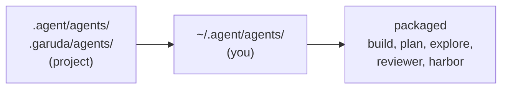

# Agent definitions

An **agent definition** says how one Garuda agent behaves: its instructions,
tools, permissions, limits and model. This page explains the format and every
field. For step-by-step recipes, see
[Level 3 · Teach it your project](../use-cases/customize.md#create-your-own-agent).

!!! abstract "In short"
    - Write `version: 1` and `extends:` a packaged agent; change only what you
      need.
    - `garuda agent check NAME` validates it; `garuda agent show NAME` shows
      every effective value and where it came from.
    - Every entry point (CLI, chat, dashboard, `garuda serve`, Python) resolves
      a name the same way.

## The smallest useful definition

```yaml
# ~/.agent/agents/careful-coder.yaml   (or .agent/agents/ in a project)
version: 1
extends: garuda/build
instructions:
  text: |
    Make the smallest change that fixes the problem.
```

`garuda run --agent careful-coder` then uses everything from the packaged
`build` agent, plus these instructions after its own. `garuda agent new NAME
--from garuda/build` writes this skeleton for you (add `--project` to write it
into the project instead of your user directory).

## Where agents come from



- A bare name is looked up in that order; the first match wins, and
  `garuda agent list` notes the ones it shadows.
- `garuda/<name>` always means the packaged agent; `user/<name>` and
  `project/<name>` pick a location explicitly.
- `--agent-file PATH` runs a definition file directly. A file is a source,
  not trust: one inside the repository is still project content.
- `--agents-dir DIR` reads agents from `DIR` instead of the project's
  `.agent/agents` and `.garuda/agents` for one run.

## extends and how settings merge

- `extends` chains up to four levels.
- Settings merge key by key; lists replace.
- `instructions.text` is appended after the parent's; `instructions.mode:
  replace` drops the parent's text.
- `tools: {add: [...], remove: [...]}` edits the parent's tool list;
  `preset:` starts from a fixed set instead.
- A definition that extends itself is refused. To change a packaged agent,
  extend `garuda/<name>` under the same name.

## Fields

Every field is optional except `version: 1`. `garuda agent show NAME` prints
the effective value of each.

| Group | Field | What it does |
|---|---|---|
| Identity | `name`, `description`, `extends` | Name, one-line summary, parent agent |
| Model | `model.binding` | A named model binding from `settings.yaml` |
| | `model.effort` | `minimal`, `low`, `medium` or `high` reasoning effort |
| | `model.thinking_budget_tokens`, `model.max_output_tokens` | Thinking and output budgets |
| | `model.collection` | Settings for the optional collection model |
| Instructions | `instructions.text`, `instructions.files` | Text, or files relative to the definition |
| | `instructions.mode` | `append` (default) or `replace` |
| Memory | `memory.user` | Load `~/.agent/AGENTS.md` (default on) |
| | `memory.project`, `memory.project_mode` | Project memory files (default `[AGENTS.md, GARUDA.md]`), `first` or `all` |
| | `memory.max_chars`, `memory.max_total_chars` | Per-file cap (8,000) and whole-prompt cap (32,000) |
| | `memory.context_pack` | Add the `.context/` architecture, decisions, discoveries and conventions |
| | `memory.notes` | `propose` gives the agent a `remember` tool ([below](#memory-notes)) |
| Skills | `skills.from`, `skills.include`, `skills.exclude`, `skills.dirs` | Which skills the agent sees |
| | `skills.load` | `index` (names only, read on demand) or `full` |
| Tools | `tools.preset` | `all`, `read-only`, `none`, or `inherit` from the parent |
| | `tools.add`, `tools.remove` | Edit the list |
| | `tools.options` | Per-tool settings ([below](#tools)) |
| | `tools.subagents` | Agents `invoke_subagent` may start |
| | `tools.mcp`, `tools.mcp_config` | Which MCP servers start, and from which config |
| | `tools.tmux`, `tools.marker_polling` | Terminal tool behaviour |
| Permissions | `permissions.mode` | `readonly`, `smart`, `auto` or `yolo` |
| | `permissions.rules.tools`, `.paths`, `.bash` | Allow, ask and deny rules |
| Context | `context.max_tokens`, `context.summarize_after_tokens`, `context.reserved_output_tokens`, `context.safety_margin_tokens` | The context budget |
| | `context.max_tool_output_bytes`, `context.min_tool_output_bytes` | Tool output size |
| | `context.condenser` | `microcompact`, `recent_window` or `summarizing` |
| | `context.request_preflight`, `context.adaptive_output`, `context.working_state_card`, `context.three_step_summary` | Context management switches |
| Limits | `limits.max_turns`, `limits.deadline_sec` | Turn and wall-clock budgets |
| Completion | `completion.mode`, `completion.verifier`, `completion.acceptance_contract` | When work counts as done |
| Workspace | `workspace.kind`, `workspace.docker.image`, `.network`, `.memory`, `.cpus` | Where commands run |
| Output | `output.schema` | A JSON Schema the final result must match ([below](#structured-output)) |

Recognised but not supported yet: `write_policy` (set it on a
[role](configuration.md#roles-and-flows-garudayaml) instead) and `hooks.*`
(use [settings hooks](configuration.md#permissions-and-hooks)). They are
refused with `agent.unsupported_field` rather than ignored.

## Tools

```yaml
tools:
  preset: read-only           # all | read-only | none | inherit
  add: [bash]
  remove: [web_fetch]
  options:
    bash: {timeout_sec: 120, max_output_bytes: 65536}
    web_fetch: {allowed_domains: [docs.python.org]}
  subagents: [explore]
```

- `read-only` is the built-in tools whose declared effect only reads, plus
  `task_complete`. `remove` also drops a same-named tool an SDK caller supplied.
- `bash` options cap a command's run time and returned output.
  `web_fetch` and `web_search` take `allowed_domains` (a host and its
  subdomains, redirects included). That is a guardrail on what the tool
  requests, not network confinement.
- **Delegation is bounded.** `tools.subagents` (default `explore`, `plan`,
  `reviewer`) is enforced when a child starts and can only narrow further down.
  A run's whole tree is limited to two levels deep, eight launches, one child
  at a time, and never past the parent's remaining turns or deadline.
- Only the MCP servers you name in `tools.mcp` start.

## What goes into the prompt

The system prompt is assembled in this order, each part labelled:

1. the agent's own instructions (never cut; if they don't fit, the agent is
   refused);
2. `~/.agent/AGENTS.md` (`memory.user`);
3. the skills index;
4. project memory files, then accepted notes from `.agent/memory.md`;
5. with `memory.context_pack: true`, the `.context/` files.

Each file is cut at `max_chars` with a `memory.truncated` notice. When the
whole prompt is too big, the context pack is trimmed first, then project
memory. `garuda agent prompt NAME` prints the result section by section, with
sizes, estimated tokens and a digest.

## Structured output

```yaml
output:
  schema: schemas/result.json     # relative to this definition
```

- The agent must finish with a `result` that matches the schema (JSON Schema
  Draft 2020-12). A wrong shape gets up to two repair turns from the run's own
  budget; then the run fails with `agent.output_invalid` and returns no
  output.
- The schema is checked when the definition loads: at most 64 KiB, 32 levels
  deep and 64 references, with `$ref` only inside the same file. `format`,
  `pattern`, `patternProperties`, `content*`, `$id`, `$anchor` and `$dynamic*`
  are refused rather than ignored.
- The accepted value is `AgentResult.output` in Python. A child agent inherits
  the schema; `schema: null` drops it. Native runs only.
- A valid shape is not verification; checks still apply.

## Memory notes

`memory: {notes: propose}` gives the agent a `remember(text, scope)` tool,
where `scope` is `user` or `project`.

- It records a **proposal** (at most 500 characters, ten per task, shared with
  subagents) and changes no file. Secret-shaped text is refused and scrubbed
  from logs.
- `garuda memory list` shows proposals; `garuda memory review` lets you
  accept, edit or reject each one, at a terminal only.
- Accepted user notes go to `~/.agent/memory.md`, project notes to
  `.agent/memory.md`. They load as reviewed information, never as instructions.
- Acceptance is recorded so it can't be applied twice, and refuses symlinks,
  another project's proposals, and a proposal that changed after you saw it.

## Checks before a run

Version 1 is strict, so a mistake is caught before anything runs:

| Code | Means |
|---|---|
| `agent.unknown_field` | A field that doesn't exist (often a typo) |
| `agent.unsupported_field` | A recognised field that isn't supported yet |
| `agent.invalid_value`, `agent.unknown_tool_option` | A bad value or tool option |
| `agent.invalid_budget` | Output reserve plus safety margin don't fit `context.max_tokens`, or a deadline isn't positive |
| `agent.required_gate` | A project agent tried to turn off `completion.verifier`, or the acceptance contract in `eval` or `rigorous` mode |
| `agent.project_widening` | A project agent asked for more than `agents.project_ceiling` allows |
| `agent.output_schema_invalid`, `_unsupported`, `_ref`, `_too_large` | A problem with the output schema |

`garuda agent check NAME_OR_PATH` prints every diagnostic with its code, the
field path and a fix, and exits `1` on an error. A project agent's Docker
limits can only narrow what you granted.

## One definition everywhere

`garuda run`, `garuda chat`, `garuda serve`, the dashboard and the SDK resolve
a definition through the same code, so `garuda agent show NAME --json` and the
prompt digest match whichever one runs it.

```python
from garuda import AgentSpec, SoftwareAgent

spec = AgentSpec.load("careful-coder", workspace=".")
agent = SoftwareAgent(workspace=".", agent=spec.narrow(limits={"max_turns": 40}))
```

- `SoftwareAgent(agent=...)` also takes a name, or a mapping
  (`AgentSpec.from_dict`; an inline mapping can't reference files). A spec is
  frozen, so concurrent runs never share one.
- `AgentSpec.narrow(...)` returns a stricter copy. Anything looser (a looser
  permission mode, more tools, wider MCP, subagent or domain allowances, larger
  budgets, a disabled check) is refused with `agent.narrow_refused`.
- `garuda serve` and the dashboard accept an agent **name** only. An inline
  definition or file over HTTP is refused (`agent.inline_over_http`);
  `--allow-agent` limits the names, and `--permission-ceiling` (serve) or
  `--max-permission` (dashboard) caps their permissions.
- Each run records the digest of the definition it started from. Resuming
  with a changed definition records both digests and leaves the earlier
  session as it was.

## Agents on roles and external harnesses

A [role](configuration.md#a-roles-agent) can run under an agent with
`agent: careful-coder`. A native role runs it exactly as `--agent` would. An
external harness keeps its own prompt, skills and memory, so it receives only
the agent's effort, permission mode and added instructions; any other field
is refused by name (`agent.field_unsupported`).

## Older profiles

Files without `version:` are legacy profiles and keep working unchanged.
`garuda agent migrate PATH` shows the version 1 form and confirms it resolves
to the same agent; `--write` replaces the file and keeps a backup. If the
result would behave differently, `--write` refuses; where it is only stricter,
it waits for `--accept-tightening`.
