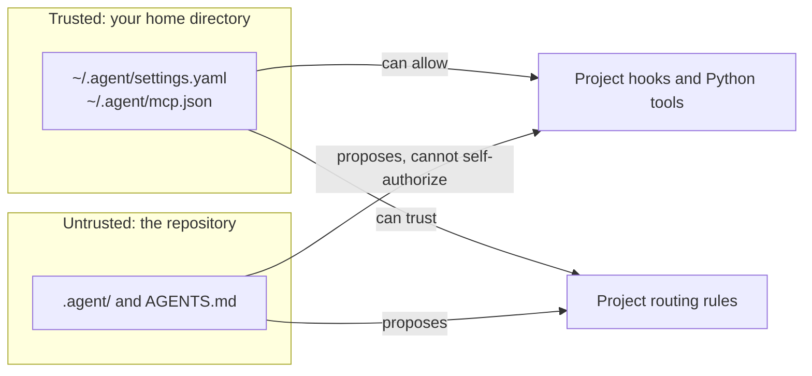
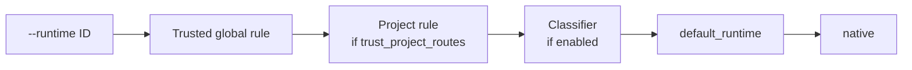

# Configuration

!!! abstract "At a glance"
    - **Global** settings in `~/.agent/settings.yaml` are trusted: models,
      collection, routing, runtimes, and the switches that allow project code.
    - **Project** settings under `.agent/` can't enable Python tools or hooks,
      trust their own routing rules, or define runtime commands. They can
      still pick permissive profiles, start MCP server commands, and turn on
      collection.
    - Command-line flags beat profiles, which beat run-mode presets, which beat
      configuration defaults.

## Where settings live

| File | Scope | Holds |
|---|---|---|
| `~/.agent/settings.yaml` | All projects, trusted | Models and bindings, collection, routing, runtime manifests, `trust_project_hooks`, `load_project_tools` |
| `~/.agent/mcp.json` | All projects, trusted | MCP servers, including per-tool `tool_effects` |
| `.agent/settings.yaml` | One project | Project defaults, proposed routing rules, `runtime_refs` aliases, classifier opt-out |
| `.agent/mcp.json` | One project | Project MCP servers (`tool_effects` here is ignored) |
| `.agent/agents/`, `.agent/skills/` | One project | Profiles and skills |
| `AGENTS.md` or `GARUDA.md` | One project | Instructions added to every run |

Set `GARUDA_GLOBAL_SETTINGS` to read global settings from another path.



## Project home

Garuda discovers project configuration in `.agent/`; `.garuda/` remains a
backwards-compatible alias.

```text
.agent/
├── agents/       # YAML or agent.md profiles
├── skills/       # <name>/SKILL.md
├── tools/        # opt-in Python tools
├── mcp.json      # project MCP servers
└── settings.yaml # project defaults
```

Root project memory (`AGENTS.md`, `GARUDA.md`) must not self-authorize project
tools or hooks; those trust decisions live in global settings. Recipes for each
file are in [Level 3 · Teach it your project](../use-cases/customize.md).

## Models

Set `GARUDA_MODEL`, or pass `--model provider/model` for one run. The provider
credential must match the model. LiteLLM handles inference routing, retries,
prompt caching, streaming, and reasoning settings.

The reasoning model is resolved in this order, first match wins:

1. `--model` or `--reasoning-model` on the command line;
2. `GARUDA_REASONING_MODEL`, then the older `GARUDA_MODEL`;
3. model bindings: one chosen explicitly through the SDK's `model_binding`,
   then the profile's, the project's, and global settings';
4. the built-in default, `openrouter/deepseek/deepseek-v4-flash-0731`.

The optional collection model follows the same order with
`--collection-model` and `GARUDA_COLLECTION_MODEL`. The `[garuda] reasoning=…`
line at startup names the model and where it came from.

### Bounded collection model

A bound collection model does nothing unless collection is enabled. Global
settings set the default; a profile or project `collection:` block can
restate `enabled`, `profile`, and `handoff`, but numeric budgets may only
narrow the global ceiling.

- The reasoning model stays the controller and must explicitly call
  `delegate_collection`.
- The worker can't edit the workspace or complete the parent task.
- `--no-collection` removes the role and its tool entirely.

```yaml
# ~/.agent/settings.yaml
models:
  strong:
    model: openrouter/example/reasoning
  fast-reader:
    model: openrouter/example/fast-reader
model_bindings:
  default:
    reasoning: strong
    collection: fast-reader
model_bindings_default: default
collection:
  enabled: true
  profile: explore
  handoff: brief            # brief or none; full is rejected
  budget:
    max_jobs_per_run: 8
    max_parallel_jobs: 3
    max_turns_per_job: 12
    max_tokens_per_job: 30000
```

How a collection job behaves:

- It gets its own collection-model context and event log.
- A `brief` handoff contains the bounded working-state card and referenced
  buffer pointers, not the parent transcript.
- Requests may narrow workspace paths and web-source URL prefixes. Evidence
  outside those scopes, or pointing at a missing buffer, is rejected.
- The parent receives a bounded JSON report. The full child trace is stored
  under the parent session's `subagents/` directory.
- If an ordinary attempt ends after gathering evidence, Garuda makes one
  terminal-only attempt with only `submit_collection` available. The same
  report and evidence validation applies.

The non-mutating toolkit and path checks are guardrails. Use a read-only mount
or an isolated snapshot when strict write confinement is required.

## Model transports

!!! note "For contributors"
    Direct transports join `garuda/model/transports.py` only with all six
    admission artifacts: a vendor-support citation (https, public docs), a
    capability declaration, a test double, an opt-in integration test, cost
    semantics where unknown stays unknown, and migration notes. Private
    endpoints, reverse-engineered subscription paths, and copied OAuth material
    are never admissible. Subscription-backed agents stay behind ACP runtimes
    instead.

## MCP

Garuda resolves `.agent/mcp.json` or YAML, `.garuda/` compatibility files,
`.cursor/mcp.json`, and global `~/.agent/mcp.json`.

- Project and global servers merge by default; project entries win name
  collisions. `GARUDA_MCP_MERGE=0` turns merging off.
- Above the direct-tool threshold (`GARUDA_MCP_MAX_DIRECT_TOOLS`), Garuda
  exposes lazy `search_tool` and `use_tool` meta-tools.
- `--mcp-config FILE` picks an explicit config for one run.

```bash
garuda mcp list --no-connect
garuda mcp list
garuda run -t "Use the issue tracker" --mcp-config custom-mcp.json
```

Collection workers treat MCP tools as effect-unknown by default. You can
authorize one exact remote tool for collection in the **global**
`~/.agent/mcp.json` entry. The same `tool_effects` key in project configuration
is ignored, so a repository can't grant its own tools collection authority.

```json
{
  "mcpServers": {
    "docs": {
      "command": "docs-mcp",
      "tool_effects": {
        "fetch_document": "read_only"
      }
    }
  }
}
```

This declaration is a trusted guardrail assertion, not confinement or proof
about the remote implementation. Side-effecting and unknown tools stay
unavailable to collection workers, and lazy `use_tool` calls re-check the
selected tool.

## Initial runtime selection

`garuda run` picks the runtime a session starts on from the first source that
applies:



`--runtime native` counts as no choice, so the later sources still apply.
Global rules, defaults, project-route trust, and the classifier live in
`~/.agent/settings.yaml`:

```yaml
# ~/.agent/settings.yaml
routing:
  default_runtime: native
  fallback_runtime: native
  trust_project_routes: false
  rules:
    - id: readonly-review
      priority: 100
      runtime: codex
      when:
        agents: [reviewer]
        modes: [readonly]
        marker_files: [pyproject.toml]
```

- Every non-empty condition in a rule must match. Higher priority wins, then
  declaration order.
- Rules can match agent, mode, tags, required capabilities, workspace kind,
  permission ceiling, language, marker files, bounded task text, and paths.
- Unknown or executable-shaped fields fail closed.
- A project may propose declarative rules in `.agent/settings.yaml`. They are
  only recommendations unless global settings set
  `trust_project_routes: true`. Project rules can't contain task regular
  expressions or runtime commands.

### Classifier

The classifier is consulted only when no explicit choice or rule selects a
runtime:

```yaml
# ~/.agent/settings.yaml
routing:
  default_runtime: native
  classifier:
    enabled: true
    model_role: collection        # or reasoning
    allow_reasoning_fallback: false
    minimum_confidence: 0.75
    candidates: [native, codex]   # omit to offer every configured runtime
    max_output_tokens: 256
    timeout_sec: 20
    on_failure: default
```

- **Input:** the task text, agent, mode, language and marker-file names, and
  the approved candidates with their capabilities. No tools and no file
  contents.
- **Output:** revalidated. An invalid, low-confidence, incapable, or timed-out
  answer uses `default_runtime`.
- **Model:** the `collection` model of the global default binding (or the alias
  named by `model_binding`). Without one, classification is skipped unless
  `allow_reasoning_fallback` is true. It is also skipped when no model binding
  is configured at all.
- **Cost:** one attempt, with thinking and reasoning settings dropped so
  `max_output_tokens` holds.
- **Project opt-out:** `.agent/settings.yaml` may only disable it, with
  `routing: {classifier: false}`.

See [External harnesses](external-harnesses.md#route-the-initial-runtime) for
runtime discovery and execution behavior.

## Permissions and hooks

Use profile permission rules as guardrails, and a Docker workspace when you
need a real confinement boundary. Project hooks and project Python tools stay
opt-in because cloned repository code must not self-authorize execution:

```yaml
# ~/.agent/settings.yaml
trust_project_hooks: true
load_project_tools: true
```

Profile rule syntax (`tool_rules`, `path_rules`, `bash_rules`) is shown in
[Create your own agent profile](../use-cases/customize.md#create-your-own-agent-profile).
Read [Safety and workspaces](safety-and-workspaces.md) before enabling project
code, permissive modes, network access, or host-backed execution.

## Environment variables

| Variable | Purpose |
|---|---|
| `GARUDA_REASONING_MODEL` | Reasoning model; beats `GARUDA_MODEL` |
| `GARUDA_MODEL` | Default model selection (reasoning role) |
| `GARUDA_COLLECTION_MODEL` | Collection model, used only when collection is enabled |
| `GARUDA_GLOBAL_SETTINGS` | Global settings path |
| `GARUDA_SESSIONS_DIR` | Session-store location |
| `GARUDA_MCP_MERGE` | Disable project/global MCP merge with `0` |
| `GARUDA_MCP_MAX_DIRECT_TOOLS` | Direct MCP schema threshold |
| `GARUDA_MODEL_MAX_CONCURRENCY` | Per-provider model-call cap |
| `GARUDA_TOKEN_PRICES` | Reproducible price overrides |
| `GARUDA_SERVE_TOKEN` | JSON-RPC server bearer token |
| `GARUDA_TRACING` | Enable OTLP tracing |
