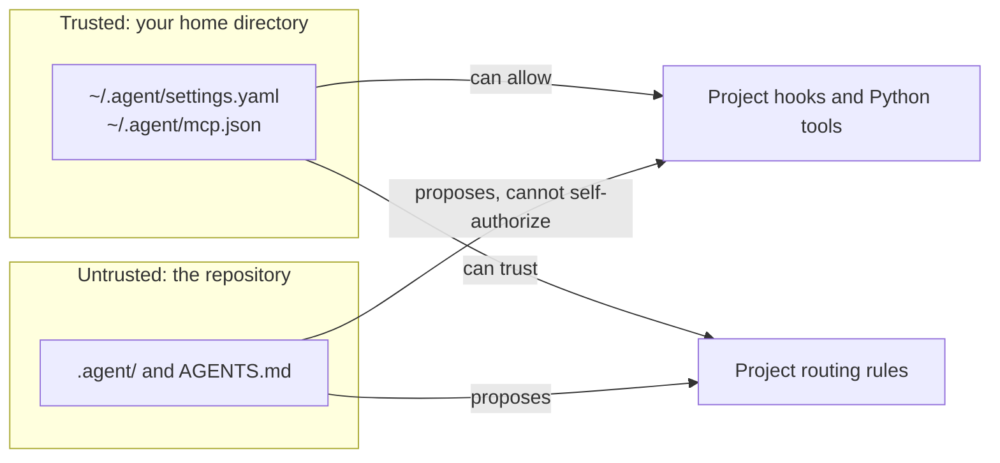
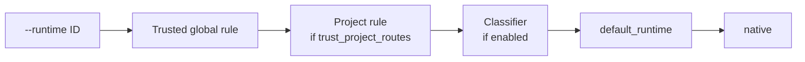

# Configuration

!!! abstract "At a glance"
    - **Global** settings in `~/.agent/settings.yaml` are trusted: models,
      collection, routing, runtimes, and the switches that allow project code.
    - **Project** settings under `.agent/` can't enable Python tools or hooks,
      trust their own routing rules, or define runtime commands. They can
      still pick permissive profiles, start MCP server commands, and turn on
      collection.
    - Command-line flags beat profiles, which beat run-mode presets, which beat
      configuration defaults.

## Where settings live

| File | Scope | Holds |
|---|---|---|
| `~/.agent/settings.yaml` | All projects, trusted | Models and bindings, collection, routing, runtime manifests, `trust_project_hooks`, `load_project_tools`, `agents.project_ceiling`, `capacity` |
| `~/.agent/mcp.json` | All projects, trusted | MCP servers, including per-tool `tool_effects` |
| `.agent/settings.yaml` | One project | Project defaults, proposed routing rules, `runtime_refs` aliases, classifier opt-out |
| `.agent/mcp.json` | One project | Project MCP servers (`tool_effects` here is ignored) |
| `.agent/agents/`, `.agent/skills/` | One project | Profiles and skills |
| `AGENTS.md` or `GARUDA.md` | One project | Instructions added to every run |

Set `GARUDA_GLOBAL_SETTINGS` to read global settings from another path.



## Project home

Garuda discovers project configuration in `.agent/`; `.garuda/` remains a
backwards-compatible alias.

```text
.agent/
├── agents/       # YAML or agent.md profiles
├── skills/       # <name>/SKILL.md
├── tools/        # opt-in Python tools
├── mcp.json      # project MCP servers
└── settings.yaml # project defaults
```

Root project memory (`AGENTS.md`, `GARUDA.md`) must not self-authorize project
tools or hooks; those trust decisions live in global settings. Recipes for each
file are in [Level 3 · Teach it your project](../use-cases/customize.md).

## Models

Set `GARUDA_MODEL`, or pass `--model provider/model` for one run. The provider
credential must match the model. LiteLLM handles inference routing, retries,
prompt caching, streaming, and reasoning settings.

The reasoning model is resolved in this order, first match wins:

1. `--model` or `--reasoning-model` on the command line;
2. `GARUDA_REASONING_MODEL`, then the older `GARUDA_MODEL`;
3. model bindings: one chosen explicitly through the SDK's `model_binding`,
   then the profile's, the project's, and global settings';
4. the built-in default, `openrouter/deepseek/deepseek-v4-flash-0731`.

The optional collection model follows the same order with
`--collection-model` and `GARUDA_COLLECTION_MODEL`. The `[garuda] reasoning=…`
line at startup names the model and where it came from.

### Bounded collection model

A bound collection model does nothing unless collection is enabled. Global
settings set the default; a profile or project `collection:` block can
restate `enabled`, `profile`, and `handoff`, but numeric budgets may only
narrow the global ceiling.

- The reasoning model stays the controller and must explicitly call
  `delegate_collection`.
- The worker can't edit the workspace or complete the parent task.
- `--no-collection` removes the role and its tool entirely.

```yaml
# ~/.agent/settings.yaml
models:
  strong:
    model: openrouter/example/reasoning
  fast-reader:
    model: openrouter/example/fast-reader
model_bindings:
  default:
    reasoning: strong
    collection: fast-reader
model_bindings_default: default
collection:
  enabled: true
  profile: explore
  handoff: brief            # brief or none; full is rejected
  budget:
    max_jobs_per_run: 8
    max_parallel_jobs: 3
    max_turns_per_job: 12
    max_tokens_per_job: 30000
```

How a collection job behaves:

- It gets its own collection-model context and event log.
- A `brief` handoff contains the bounded working-state card and referenced
  buffer pointers, not the parent transcript.
- Requests may narrow workspace paths and web-source URL prefixes. Evidence
  outside those scopes, or pointing at a missing buffer, is rejected.
- The parent receives a bounded JSON report. The full child trace is stored
  under the parent session's `subagents/` directory.
- If an ordinary attempt ends after gathering evidence, Garuda makes one
  terminal-only attempt with only `submit_collection` available. The same
  report and evidence validation applies.

The non-mutating toolkit and path checks are guardrails. Use a read-only mount
or an isolated snapshot when strict write confinement is required.

## Model transports

!!! note "For contributors"
    Direct transports join `garuda/model/transports.py` only with all six
    admission artifacts: a vendor-support citation (https, public docs), a
    capability declaration, a test double, an opt-in integration test, cost
    semantics where unknown stays unknown, and migration notes. Private
    endpoints, reverse-engineered subscription paths, and copied OAuth material
    are never admissible. Subscription-backed agents stay behind ACP runtimes
    instead.

## MCP

Garuda resolves `.agent/mcp.json` or YAML, `.garuda/` compatibility files,
`.cursor/mcp.json`, and global `~/.agent/mcp.json`.

- A server from a project file (including `.cursor/mcp.json`) starts only after
  you trust it with `garuda mcp trust`. The grant covers that exact entry and
  any repository script it runs, in that repository; untrusted servers are
  skipped with `agent.untrusted_project_code`, and a profile that requires one
  refuses. `--mcp-config FILE` and the global file are yours and need no grant.
- Project and global servers merge by default; trusted project entries win name
  collisions. `GARUDA_MCP_MERGE=0` turns merging off.
- Above the direct-tool threshold (`GARUDA_MCP_MAX_DIRECT_TOOLS`), Garuda
  exposes lazy `search_tool` and `use_tool` meta-tools.
- `--mcp-config FILE` picks an explicit config for one run.

```bash
garuda mcp list --no-connect
garuda mcp list
garuda run -t "Use the issue tracker" --mcp-config custom-mcp.json
```

Collection workers treat MCP tools as effect-unknown by default. You can
authorize one exact remote tool for collection in the **global**
`~/.agent/mcp.json` entry. The same `tool_effects` key in project configuration
is ignored, so a repository can't grant its own tools collection authority.

```json
{
  "mcpServers": {
    "docs": {
      "command": "docs-mcp",
      "tool_effects": {
        "fetch_document": "read_only"
      }
    }
  }
}
```

This declaration is a trusted guardrail assertion, not confinement or proof
about the remote implementation. Side-effecting and unknown tools stay
unavailable to collection workers, and lazy `use_tool` calls re-check the
selected tool.

## Initial runtime selection

`garuda run` picks the runtime a session starts on from the first source that
applies:



Naming a runtime with `--runtime`, including `--runtime native`, pins it. Omit
the flag to let the later sources choose.
Global rules, defaults, project-route trust, and the classifier live in
`~/.agent/settings.yaml`:

```yaml
# ~/.agent/settings.yaml
routing:
  default_runtime: native
  fallback_runtime: native
  trust_project_routes: false
  rules:
    - id: readonly-review
      priority: 100
      runtime: codex
      when:
        agents: [reviewer]
        modes: [readonly]
        marker_files: [pyproject.toml]
```

- Every non-empty condition in a rule must match. Higher priority wins, then
  declaration order.
- Rules can match agent, mode, tags, required capabilities, workspace kind,
  permission ceiling, language, marker files, bounded task text, and paths.
- Unknown or executable-shaped fields fail closed.
- A project may propose declarative rules in `.agent/settings.yaml`. They are
  only recommendations unless global settings set
  `trust_project_routes: true`. Project rules can't contain task regular
  expressions or runtime commands.

### Classifier

The classifier is consulted only when no explicit choice or rule selects a
runtime:

```yaml
# ~/.agent/settings.yaml
routing:
  default_runtime: native
  classifier:
    enabled: true
    model_role: collection        # or reasoning
    allow_reasoning_fallback: false
    minimum_confidence: 0.75
    candidates: [native, codex]   # omit to offer every configured runtime
    max_output_tokens: 256
    timeout_sec: 20
    on_failure: default
```

- **Input:** the task text, agent, mode, language and marker-file names, and
  the approved candidates with their capabilities. No tools and no file
  contents.
- **Output:** revalidated. An invalid, low-confidence, incapable, or timed-out
  answer uses `default_runtime`.
- **Model:** the `collection` model of the global default binding (or the alias
  named by `model_binding`). Without one, classification is skipped unless
  `allow_reasoning_fallback` is true. It is also skipped when no model binding
  is configured at all.
- **Cost:** one attempt, with thinking and reasoning settings dropped so
  `max_output_tokens` holds.
- **Project opt-out:** `.agent/settings.yaml` may only disable it, with
  `routing: {classifier: false}`.

See [External harnesses](external-harnesses.md#route-the-initial-runtime) for
runtime discovery and execution behavior.

## Permissions and hooks

Use profile permission rules as guardrails, and a Docker workspace when you
need a real confinement boundary. Project hooks and project Python tools stay
opt-in because cloned repository code must not self-authorize execution:

```yaml
# ~/.agent/settings.yaml
trust_project_hooks: true
load_project_tools: true
```

Hooks are shell commands that receive a JSON event on stdin. A `before_tool`
hook is a guard and **fails closed**: exit 0 allows the call, exit 2 blocks it,
and anything else (another exit code, a command that can't start, a timeout)
blocks it too, logged as `hook.failed_blocked`. Each hook runs in its own process
group, which is killed on timeout:

```yaml
# ~/.agent/settings.yaml
hooks:
  before_tool:
    - match: "bash"
      command: "./guard.sh"
      timeout: 10            # seconds, at most 300 (default 30)
  after_tool:
    - match: "*"
      command: "./log-call.sh"
```

Set `on_failure: allow` on a hook in your global file to make it advisory; a
project's hooks always fail closed. If a guard rewrites a call, the rewritten
call is permission-checked again before it runs.

Profile rule syntax (`tool_rules`, `path_rules`, `bash_rules`) is shown in
[Create your own agent profile](../use-cases/customize.md#create-your-own-agent-profile).
Read [Safety and workspaces](safety-and-workspaces.md) before enabling project
code, permissive modes, network access, or host-backed execution.

## Usage ledger

Garuda keeps a usage ledger in your Garuda home (`usage/YYYY-MM.jsonl`, owner-only, one
file per month) so statistics survive pruned sessions. It records **identities and counts
only**: ids, role, origin and call purpose as separate fields, harness, adapter version
and exact model id, token counts, a known cost or `null`, and durations. It never holds
task text, prompts, outputs, tool arguments, account names, raw provider payloads or
paths, and the writer refuses any field outside its schema.

- A native session's calls are written as they happen, once each, including the
  summarizer, `buffer_query`, contract and verifier calls that used to be uncounted; its
  ledger totals equal the session's own metrics.
- An external (ACP) harness's usage reports stay **snapshots** (latest wins, never summed
  and never a call count) until a policy for that exact adapter version is proved.
  Simultaneous per-turn and cumulative reports are never added together. A gap, reset,
  decrease or adapter change leaves the delta unavailable instead of guessing.
- Unknown cost stays unknown (`null`), never zero. A session killed mid-run is incomplete
  until reconciled from its event log, which adds only what is missing.
- Month files are kept for 13 months; cleaning up sessions does not touch them.

## Runtime capacity

Limit how many runs of one runtime may be active at once, across every way of
starting one (CLI, SDK, dashboard, server, handoffs):

```yaml
# ~/.agent/settings.yaml
capacity:
  native: 2
  claude: 1
  codex: 1
```

A run that finds its runtime full is refused right away rather than queued. A
runtime with no entry isn't limited. Only the global settings file can set this.

The ceiling can also be written as `harnesses.<id>.max_parallel` in your own
`garuda.yaml`; a `capacity` entry in `settings.yaml` wins when both exist, and
a project file can't set either. Background sessions wait in a durable FIFO
queue per user and harness (`~/.agent/queue/`) and draw from this same limit:
there is no separate queue capacity. Queue reservations keep counting through
interrupted selection, release and activated-worker death. Ordinary launches
cannot reclaim those slots independently of the queue coordinator.

Queue enqueue retries preserve the existing entry and its FIFO position only
when the item id, scope, user, harness, session and configuration digest match
exactly. This also applies after the entry is claimed. A conflicting retry
refuses instead of replacing admitted work or adding a duplicate.

A dispatch-ready entry uses exactly `<user>:<harness>` for its declared user
and harness. Changing only the scope label cannot bypass an older entry in
that lane. Enqueue rejects mismatches before touching storage, and selection
also checks preexisting records. The default user is the local uid; use
`scope_for(harness)` for that scope, or provide the matching user explicitly
when using a synthetic user scope. A mismatched historical entry stays intact
for diagnosis and is not rebound automatically. Incomplete allocations still
cannot activate without frozen session/configuration bindings.

Background runs resolve their effective `garuda.yaml` role before joining the
queue. A default role keeps its permissions, model and profile when the worker
starts; its original harness reference preserves runtime-alias restrictions.
Workers recheck the effective `garuda.yaml` configuration before selecting
work. A changed role runtime or model refuses. This check does not snapshot
referenced agent/MCP files or prevent later concurrent configuration edits.
Roles with a dynamic `fallback` chain refuse in background mode until the
chosen runtime can be persisted; use a role without fallback or run it in the
foreground. Admission performs no probes or model calls.

A background runtime alias shares its target's capacity and FIFO lane. Its
original reference stays in the launch arguments for downstream capability
resolution. If the alias is retargeted while waiting, or launch
arguments or their digest receipt disagree with the queued admission, the
worker refuses before selection. The admission remains available for diagnosis;
Garuda does not silently rebind it. The receipt covers serialized arguments,
not a snapshot of every referenced configuration file.

A release attempt revokes the committed process-local ticket before publishing
its intent. If publication fails, the retained claimant handle cannot dispatch,
and an ordinary capacity call that captured the ticket must recheck adoption
before returning launch authority. The protected slot remains allocated; a
partially published activation stays quarantined rather than being replayed.

An ordinary foreground reservation remains counted after its owner dies.
Parent death does not prove that runtime descendants, including processes in
another group, stopped. Both foreground and queue admission retain such slots;
a matched dead/unknown ordinary owner also cannot retry activation. Explicit
matched release remains a coordinator cleanup assertion. Automatic recovery
needs descendant cleanup receipts, which are not implemented by this change.

Queue heartbeat and release accept an explicit owner matching the complete
claim record. Without an explicit owner, they use only the owner retained by
the instance that successfully claimed the item in the current process.
Another instance or an inherited fork cannot release the claim implicitly.
If workspace acquisition fails, requeue also checks the original owner before
returning capacity, so a replacement claim remains intact.

Inspecting a queue through `entries()` or `snapshot()` reads its published
document without waiting for a writer lock. Opening the store for inspection
does not create directories, change permissions, migrate historical records
or write backups. A missing queue remains absent; corrupt and future-version
records refuse inspection and remain intact for diagnosis.

Prototype version 1 queues containing jobs also refuse mutation: those jobs
lack user, session and configuration bindings, even if their owners are dead.
Inspect the original `state.json` and resolve historical work with the prior
version. Valid empty queues and fully bound, ordered version 2 waiters migrate
to version 3, after exact original bytes are durably preserved as `state.json.v1`
or `state.json.v2`. Version 2 claims refuse because activation history is missing.
An unrelated, partial, symlinked
or nonregular backup refuses migration and is left intact; do not delete it
without resolving that ambiguity. The old queue capacity cannot widen the
configured shared limit.

Selection publishes a queue intent, reserves a protected shared slot, then
commits the claim before granting local activation authority. Dispatch records
activation before invoking the runtime. A release fences activation in capacity,
removes the claim durably, then returns its slot. A thread that captured its
ticket before release cannot activate through that fence. The fence keeps prior
activation history. `recover_pending()` reconciles only safe operations
whose owners are confirmed dead; it never starts work. Activated or ambiguous
dispatch remains quarantined because worker death does not prove descendant
cleanup. Inspection exposes pending operations without repairing them.

Capacity records now use version 2 to distinguish queue reservations. Nonempty
version 1 capacity records stay readable but refuse mutation, even for dead
owners: their reservation origin is unknown. Resolve them with the prior version
before upgrading. Valid empty records preserve an exact private `.json.v1`
backup before upgrade; backup ambiguity refuses. Full descendant supervision
and cleanup receipts remain separate lifecycle requirements.

## Agent definitions

An agent definition says how one Garuda agent behaves: its instructions,
tools, permissions, limits and model. The smallest useful one changes one
thing about a packaged agent:

```yaml
# ~/.agent/agents/careful-coder.yaml   (or .agent/agents/ in a project)
version: 1
extends: garuda/build
instructions:
  text: |
    Make the smallest change that fixes the problem.
```

`garuda run --agent careful-coder` then uses everything from the packaged
`build` agent except the extra instructions, which are appended to its own.

- A bare name is looked up in the project (`.agent/agents/`, then
  `.garuda/agents/`), then in your user directory (`~/.agent/agents/`), then
  among the packaged agents. `garuda/build` always means the packaged one;
  `user/<name>` and `project/<name>` pick a location explicitly.
- `extends` chains up to four levels. Settings merge key by key; lists
  replace; `tools: {add: [...], remove: [...]}` edits the parent's tool list
  and `preset: none` starts from an empty one; `instructions.mode: replace`
  drops the parent's text. A definition that extends itself refuses —
  extend `garuda/<name>` to change a packaged agent.
- Version 1 is strict: unknown fields, unknown tools, a missing instruction
  file and duplicate keys refuse, each with a code such as
  `agent.unknown_field`. A field Garuda recognizes but does not support yet
  (for example `hooks:`) refuses with `agent.unsupported_field`
  rather than being ignored.
- Numbers are checked before the agent starts: the output reserve plus the
  safety margin must fit inside `context.max_tokens`, `summarize_after_tokens`
  must be below it, and a deadline must be positive (`agent.invalid_budget`).
  A project definition cannot turn off `completion.verifier`, nor the
  acceptance contract in the `eval` or `rigorous` modes that require it
  (`agent.required_gate`), and its
  `workspace.docker` limits can only narrow what you granted.
- `garuda agent show NAME` prints every effective value and where it came
  from; `garuda agent prompt NAME` prints the system prompt the first request
  will send, section by section, and its digest. Both redact secrets unless
  you pass `--raw`, and neither starts an MCP server, a hook or a model. A run
  records the digest of the system message it actually sent; it differs from
  the static one once runtime blocks such as the environment snapshot are
  added.
- `memory:` chooses what else goes into the system prompt, after the agent's
  own instructions and in this order: your `~/.agent/AGENTS.md` (`user`, on
  by default for version 1 definitions), the skills index, the project's
  memory files (`project: [AGENTS.md, GARUDA.md]`, `project_mode: first` or
  `all`), and with `context_pack: true` the `.context/` architecture,
  decisions, discoveries and conventions files. Each file is cut at
  `max_chars` (8000) with a `memory.truncated` notice; the whole prompt is
  capped at `max_total_chars` (32000) and must fit the model's token budget,
  trimming the context pack first and then project memory. The agent's own
  instructions are never cut — a definition whose instructions do not fit
  refuses. Project memory must stay inside the repository.
- `skills:` picks the agent's skills. Sources are this project's
  `.agent/skills` (and `.garuda/skills`), your `~/.agent/skills`, then the
  packaged ones; when two define the same name, the nearer wins and
  `garuda agent show` lists the shadowed copies. `from: [project, user,
  packaged]` limits the sources, `include` (`null`: all; `[]`: none) and
  `exclude` filter by name, and `load: index` (the default: names and paths,
  read on demand) or `full` puts every body in the prompt. A skill's
  `allowed-tools` is advice to the model, not enforcement; `garuda agent
  check` warns (`skill.tool_not_granted`) when it names a tool the agent
  lacks. Project skills are project text and grant nothing.
- `tools:` shapes what the agent can call. `preset: all` is every built-in
  tool, `read-only` is the built-ins whose declared effect only reads (plus
  `task_complete`), and `none` starts empty; `add` and `remove` edit the result,
  and `remove` also drops a same-named tool an SDK caller supplied. Per-tool
  settings go under `options`: `bash: {timeout_sec, max_output_bytes}` caps how
  long a command may run and how much output returns, and `web_fetch` /
  `web_search` take `allowed_domains` (a host or its subdomains, redirects
  included). Unknown tools, options and bad values refuse
  (`agent.unknown_tool_option`, `agent.invalid_value`). `allowed_domains` is a
  guardrail on what the tool requests, not network confinement.
- `tools.subagents` lists the agents `invoke_subagent` may start (version 1
  default: `explore`, `plan`, `reviewer`; legacy profiles: any). The list is
  the tool's schema and is enforced when the child starts, and it can only
  narrow further down. A run's delegation is bounded: two levels deep, eight
  launches across the whole tree, one child at a time, never past the
  parent's remaining turns or deadline. Refusals say why
  (`agent.subagent_not_allowed`, `agent.delegation_too_deep`,
  `agent.delegation_exhausted`, `agent.delegation_busy`,
  `agent.delegation_deadline`). Only the MCP servers you select in
  `tools.mcp` are started.
- `output: {schema: schemas/result.json}` makes `task_complete` carry a
  structured `result` that must satisfy a JSON Schema (Draft 2020-12) before
  the task is accepted. The file is relative to the definition that names it,
  stays inside the agent's root, and is checked when the definition resolves:
  at most 64 KiB, 32 levels deep, 64 references and a bounded expansion, with
  `$ref` only to the same file (`#/$defs/...`; no remote or file references,
  no cycles). A keyword Garuda does not support refuses rather than being
  ignored: `format`, `pattern`, `patternProperties`, `content*`, `$id`,
  `$anchor` and `$dynamic*`. Codes: `agent.output_schema_invalid`,
  `_unsupported`, `_ref`, `_too_large`. A wrong `result` is sent back with the
  reasons for at most two repair turns, which are ordinary turns from the run's
  own turn and deadline budget; after that the run fails with
  `agent.output_invalid` and returns no output. A valid shape is not task
  verification: the usual completion and verification gates still apply. The
  accepted value is `AgentResult.output`. A child inherits the schema, and
  `schema: null` drops it. Native runs only.
- `memory: {notes: propose}` gives the agent a `remember(text, scope)` tool
  (`scope` is `user` or `project`). It records a **proposal** (at most 500
  characters, ten per root task, shared with its subagents) and changes no
  memory file. Secret-shaped text is refused, and scrubbed before it can reach
  the event log or the saved transcript. `garuda memory review` lists the
  proposals; you accept, edit or reject each one, at a terminal only (a headless
  run can propose but never accept). Accepted user notes append to
  `~/.agent/memory.md` and load after your `AGENTS.md`; accepted project notes
  append to `.agent/memory.md` and load after the project's memory files, both
  labelled as reviewed information, never instructions. Acceptance is
  journaled so a replay can't append twice, and refuses symbolic links, another
  project's proposals and a proposal that changed after you saw it. The
  dashboard lists pending proposals read-only. If a needed safeguard is missing,
  `notes: propose` refuses (`agent.notes_unavailable`) rather than running
  without it.
- **One definition everywhere.** `garuda run`, `garuda chat`, `garuda serve`,
  the dashboard and the SDK resolve a definition through the same code, so
  `garuda agent show NAME --json` and the prompt digest are the same whichever
  entry point runs it. `--agent-file PATH` (run, chat; also `agent show`)
  selects a file; it is a source, not trust, so a file inside the repository is
  still project content under the project ceiling. In Python:

  ```python
  from garuda import AgentSpec, SoftwareAgent

  spec = AgentSpec.load("careful-coder", workspace=".")
  agent = SoftwareAgent(workspace=".", agent=spec.narrow(limits={"max_turns": 40}))
  ```

  `SoftwareAgent(agent=...)` also takes a name or a mapping (`AgentSpec.from_dict`;
  an inline mapping can't reference instruction or schema files). A spec is frozen
  and hands out copies, so concurrent runs never share one.
- `AgentSpec.narrow(...)` returns a stricter copy and nothing else. A looser
  permission mode, more tools, wider MCP, subagent or domain allowances, larger
  budgets, a disabled check, and any setting not listed as narrowable refuse
  with `agent.narrow_refused`.
- `serve` and the dashboard take an agent **name** only. An inline definition,
  `agent_file` or (with an allowlist) `agents_dir` over a request refuses
  (`agent.inline_over_http`); `--allow-agent` limits which names (`agent.not_allowed`),
  and the run never exceeds `--permission-ceiling` (`serve`; default the server's
  own `--agent`) or `--max-permission` (dashboard), so naming `garuda/harbor`
  cannot raise the server's authority.
- Each run records the digest of the definition it started from
  (`agent_digest` in the session). Resuming with a changed definition does not
  alter the earlier session: the new session records an `agent_segment` with both
  digests.
- Files without `version` are legacy profiles and keep working unchanged.
  `garuda agent migrate PATH` shows the version 1 form and confirms it
  resolves to the same agent; `--write` replaces the file and keeps a backup.

## Roles and flows: garuda.yaml

`garuda.yaml` is a new, optional file that names **roles** — which harness and
exact model to use for which job — and the flows and checks built on them.
Nothing that works today needs it, and `settings.yaml` keeps working
unchanged beside it.

- The **user** file lives next to your settings, normally `~/.agent/garuda.yaml`.
- A **project** file `garuda.yaml` at the repository root may add checks and
  flows and narrow your roles.

```yaml
# ~/.agent/garuda.yaml
version: 1
defaults: {role: coder}
harnesses:
  claude-code: {allowed_models: [<exact-id>], max_parallel: 2}
  codex: {allowed_models: [<exact-id>]}
roles:
  planner:  {harness: claude-code, model_id: <exact-id>, permissions: smart, write_policy: no-edits}
  coder:    {harness: codex, model_id: <exact-id>, effort: high,
             fallback: [{harness: claude-code, model_id: <exact-id>}], consult: [reviewer]}
  reviewer: {harness: claude-code, model_id: <exact-id>, permissions: smart, write_policy: no-edits}
consults: {max_per_session: 5, timeout_sec: 600, max_answer_chars: 8000}
sessions: {isolation: auto, keep_days: 30}
```

How the layers combine (package default, then user, then project, then the
command line):

- A role or flow with the same name **replaces** the whole definition below it.
- Permission ceilings and consult limits **intersect**: the stricter one wins.
- Checks **accumulate**; an identical check is listed once.
- `harnesses`, `sessions.keep_days`, `fallback` chains and `consult` grants are
  **yours only**: a project file may keep a subset or remove them, never add.
- `--runtime` or `--model` on the command line skips an implicit
  `defaults.role`.

The file is strict: unknown or duplicate keys, YAML tags, values out of range
and an `authority` key are refused with the full path of the value, before
anything starts. A `settings.yaml` key such as `routing` in a `garuda.yaml`, a
`max_parallel` that disagrees with `capacity`, or a `--runtime` that
contradicts the selected role is refused as `config.conflict`.

`garuda config migrate` previews the user `garuda.yaml` that carries what
`settings.yaml` already says (trusted runtimes as `harnesses`, `capacity` as
`max_parallel`); `--write` applies it, keeping a backup of any existing file.
It never removes anything from `settings.yaml`, and running it twice changes
nothing.

A project file can narrow your roles without asking. It cannot make Garuda
run something it chose — its `checks`, or a model string for the `native`
harness — until you trust it: `garuda config trust` shows exactly what the
file would run and asks. Trust covers those exact bytes in that repository;
any change to the file needs trust again, and a symlinked `garuda.yaml` is
refused. Until then those values are ignored and the run says so
(`config.project_untrusted`). A role a project adds may not ask for more
than `agents.project_ceiling` allows, and a headless run can never create
trust.

`garuda run --role coder` (or `defaults.role`, unless you pass `--runtime` or
`--model`) runs as that role. A native role sets the model, reasoning effort,
permission mode and profile exactly as the matching flags would; a
`--permission-mode` you pass and the role's ceiling combine to the stricter
of the two. Model ids are used exactly as written, never matched loosely.

For an ACP harness, Garuda sets the agent's own model and effort options
(`session/set_config_option`) before the first prompt, and only on an adapter
version where that was proven (today Claude Code adapter 0.85.0 and Codex
adapter 2.1.1). The agent must offer the exact id in its session; a missing or
changed id, or an unproven adapter, refuses before anything is prompted. A
role with no model or effort runs on any adapter version. The role, the ids
set and the adapter version are recorded on the session.

### A role's agent

`roles.<name>.agent: careful-coder` runs the role under an [agent definition](#agent-definitions)
(`profile:` is the older spelling of the same key; naming two different agents is
`config.conflict`). The definition is resolved for the harness that will actually run, after any
fallback was chosen, and its digest becomes part of the role's identity on the session, so
changing the definition changes the identity.

- **Native roles** run exactly as `garuda run --agent careful-coder` would. If the role and the
  definition name different efforts, the run refuses (`config.conflict`).
- **ACP roles** (an external harness has its own prompt, skills and memory) receive only what
  the harness can honour: the definition's `model.effort`, its `permissions.mode` (combined with
  the role's as the stricter of the two) and its appended `instructions`, which arrive as a
  labelled block of user-supplied role instructions before your first task message, never as a
  system prompt. Anything else the definition asks for, directly or through `extends` - skills,
  memory, a tool list, `tools.mcp`, limits, completion checks, a final-output schema, permission
  rules, a model binding, or replacing the prompt - refuses by name as
  `agent.field_unsupported`; defaults a definition does not declare are not expanded and
  rejected. Forwarding MCP servers to an external harness is not enabled. A fallback that changes
  the harness kind is projected again, and a definition the new harness cannot honour refuses
  rather than falling back.
- **Consulted native roles** keep the definition's model, instructions, memory and skills but use
  the consult profile's read-only tools and limits, whatever tools the definition grants. A
  definition that requires a final-output schema or a completion check cannot be honoured by a
  read-only question-and-answer child and refuses the consult
  (`consult.target_unavailable`).

### Fallbacks

A role's `fallback` list (your user file only; a project file may only remove
entries) is tried once, before the run starts. Garuda moves past the role's
own harness, or an entry, only when its CLI is not installed
(`harness.cli_missing`) or its documented login check says you are logged
out (`harness.logged_out`). A login check that fails, times out or answers
something unexpected is not a reason to move on. Once a prompt is sent there
is no fallback, and trust, configuration or confinement errors refuse rather
than fall back. The session records which harness was planned, which one ran
and why; if none can start, the run refuses and lists every reason.

## Environment variables

| Variable | Purpose |
|---|---|
| `GARUDA_REASONING_MODEL` | Reasoning model; beats `GARUDA_MODEL` |
| `GARUDA_MODEL` | Default model selection (reasoning role) |
| `GARUDA_COLLECTION_MODEL` | Collection model, used only when collection is enabled |
| `GARUDA_GLOBAL_SETTINGS` | Global settings path |
| `GARUDA_SESSIONS_DIR` | Session-store location |
| `GARUDA_MCP_MERGE` | Disable project/global MCP merge with `0` |
| `GARUDA_MCP_MAX_DIRECT_TOOLS` | Direct MCP schema threshold |
| `GARUDA_MODEL_MAX_CONCURRENCY` | Per-provider model-call cap |
| `GARUDA_TOKEN_PRICES` | Reproducible price overrides |
| `GARUDA_SERVE_TOKEN` | JSON-RPC server bearer token |
| `GARUDA_TRACING` | Enable OTLP tracing |
