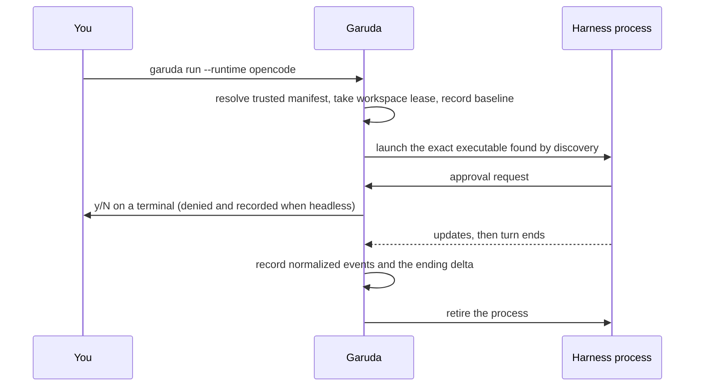
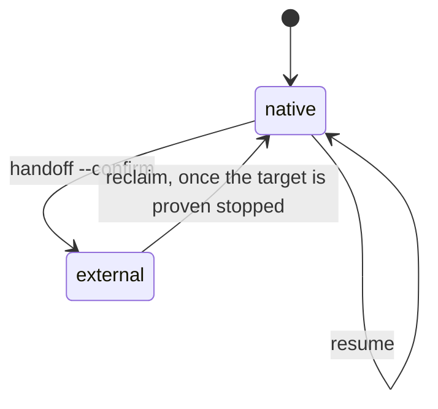

# External harnesses

Garuda can launch subscription-backed coding harnesses through the Agent Client
Protocol (ACP) while keeping its native model-and-tool loop as the default. The
shipped trusted catalog includes `claude`, `codex`, `cursor`, `opencode`, `pi`,
and `goose`.

!!! abstract "At a glance"
    - You install and log in to each vendor CLI yourself. Garuda launches it but
      never reads, copies, stores, or proxies your vendor OAuth credentials.
    - The harness edits and runs commands **with its own authority**. Garuda's
      permission rules, Docker and sandbox workspaces, and completion checks do
      not confine it.
    - Garuda records the session, approvals, lease, baseline, and workspace
      changes. "Completed" means the harness ended its turn, not that Garuda
      verified the result.
    - Quick recipes: [Level 5 · Advanced](../use-cases/advanced.md).

## Native and ACP behavior differ

| Behavior | Native runtime | ACP runtime |
|---|---|---|
| Controller | Garuda model loop | External harness |
| Tool permissions | Enforced by Garuda's permission engine | Harness requests can flow through the approval broker, but native tool rules don't confine the harness |
| Completion | Garuda's completion checks for the selected mode | The harness ended its turn; Garuda does not verify the result |
| Session evidence | Messages, events, baseline, delta, metrics | Normalized events, runtime segment, child record, baseline, and delta where available |
| Credentials | Provider API key for the selected model | Your vendor CLI login |

ACP execution doesn't place the harness inside a Garuda Docker or OS-sandbox
workspace. It runs as its own subprocess. When running untrusted code, use the
vendor's controls and an independently isolated workspace. See
[Safety and workspaces](safety-and-workspaces.md).

## Discover installed runtimes

```bash
garuda runtime list
garuda runtime inspect opencode
```

- Add `--json` for machine-readable health records.
- Discovery reports whether the executable resolves, its declared capabilities
  and version, setup guidance, and any login or quota information the vendor
  reports.
- Missing login or quota data stays `unknown`. Garuda doesn't infer it from
  credential files or assume unknown cost is zero.
- A catalog entry can be unavailable because its executable is missing, it is
  disabled in trusted global configuration, or its version probe fails.
  `garuda runtime inspect <id>` is the first troubleshooting step.

## Run a task directly on ACP

```bash
garuda run --workspace . --runtime opencode -t "Inspect the failing tests"
```



Unknown, disabled, or missing runtimes are refused. If an installed harness
fails to start and the workspace is unchanged, Garuda moves the session once
to `fallback_runtime` (native by default) and records the reason in the
session.

## Route the initial runtime

Initial selection uses the first applicable source:

1. explicit `--runtime` naming a non-native runtime (`--runtime native` counts
   as no choice);
2. a trusted global deterministic routing rule;
3. a project rule, only when global settings authorize project routing;
4. the optional trusted classifier;
5. the configured default runtime; and
6. built-in `native`.

Global `~/.agent/settings.yaml` owns runtime manifests, rules, defaults, and the
classifier. A project may define aliases to trusted runtime IDs or opt out of
the classifier, but can't provide an executable command or broaden global
authority. The classifier receives bounded task metadata and approved
candidates, not file contents or tools, and its choice is revalidated. Details:
[Initial runtime selection](configuration.md#initial-runtime-selection).

## Hand off a native session

Preview first. Without `--confirm`, nothing changes:

```bash
garuda runtime handoff --session latest --to opencode
garuda runtime handoff --session latest --to opencode --confirm
```

Add `--workspace` when an older native session recorded a relative workspace
and you aren't running from that directory.

The confirmed transaction is one-shot:

1. pause the native source;
2. checkpoint its state and capture the workspace delta;
3. start the exact target executable found during the pre-check;
4. persist the target segment and acknowledgement, then record its child;
5. close the native source;
6. send the bounded handoff package as the target's first prompt; and
7. close and retire the target after its turn.

!!! warning "Acknowledgement is the point of no return"
    A failure **before** acknowledgement rolls back to the native source. A
    failure **after** it is a target failure: Garuda closes the target and
    records the failure, but doesn't undo changes the target may have made. The
    session belongs to the target after acknowledgement in either case.

Handoff packages contain bounded task state, evidence references, workspace
delta context, and redacted metadata. They never contain vendor credentials,
raw secrets, or an unbounded copy of the transcript.

## Resume, recover, reclaim, and support

Every runtime command that takes `--session` accepts a full ID, the unique
prefix printed by `garuda sessions`, or `latest`. Ambiguous and missing
references fail before preview, lease acquisition, or mutation.



```bash
garuda runtime recover --session latest --json
garuda runtime reclaim --session latest
garuda runtime resume --session latest -t "Continue after the external run"
garuda runtime support --session latest
```

| Command | Does |
|---|---|
| `recover` | Classifies interrupted state as `resumable`, `rolled_back`, or `external`. An `external` session refuses native resume and another handoff while the target may still be acting |
| `reclaim` | Returns ownership to native. Refuses while a workspace lease, a live recorded child, or an active target state says the harness may still be running. It repairs ownership; it does not roll back external changes |
| `resume` | Continues a native session through the normal run lifecycle |
| `support` | Prints a redacted bundle (runtime lanes, kind tallies, timing metrics, scrubbed metadata) without raw event payloads |

## Dashboard, SDK, and service surfaces

- **Dashboard:** the Runtimes board lists and inspects catalog entries, previews
  and prepares handoffs, shows workspace deltas, and runs recovery. Dashboard
  chat still starts the native loop.
- **SDK:** `SoftwareAgent(runtime="opencode")` runs one ACP turn and returns an
  `AgentResult`. `Conversation` can start on ACP and switch ACP-to-ACP through
  the transactional handoff path, but refuses an in-process native-to-ACP
  switch; use the CLI handoff for that.
- **Service:** the JSON-RPC server exposes runtime list, inspect, handoff,
  recover, and support methods through the same trusted catalog. Request
  payloads can't provide launch manifests.

## Vendor setup

=== "Claude Code"

    - Launch command: `claude-agent-acp` from
      `@agentclientprotocol/claude-agent-acp`.
    - Install Node.js 20+, install and log in to Claude Code, then install the
      ACP package globally and verify `claude-agent-acp --version`.
    - Authentication stays in the Claude Code login. Don't set
      `ANTHROPIC_API_KEY` when you intend to use subscription billing.

=== "Codex"

    - Launch command: `codex-acp` from `@agentclientprotocol/codex-acp`.
    - Install Node.js 20+ and the Codex CLI, run `codex login`, install the ACP
      package, and verify `codex-acp --version`.
    - Authentication stays in the Codex CLI login.

=== "Cursor Agent"

    - Launch command: `agent acp`, a Cursor Agent CLI subcommand.
    - Install and authenticate Cursor Agent, then verify `agent --version`.
    - Garuda answers `session/request_permission`. Unsupported blocking
      extensions such as `cursor/ask_question` and `cursor/create_plan` fail
      closed with a method-not-found response.

=== "OpenCode"

    - Launch command: `opencode acp` from the `opencode-ai` package.
    - Install and authenticate OpenCode, then verify `opencode --version`.
    - Authentication stays in OpenCode's own configuration.

=== "Pi"

    - Launch command: `pi-acp` from the `pi-acp` package.
    - Install the package, authenticate Pi, then verify `pi-acp --version`.

=== "Goose"

    - Launch command: `goose acp`, a Goose CLI subcommand.
    - Install and authenticate Goose, then verify `goose --version`.

## Environment and protocol limits

- Shipped manifests declare no credential-file login probe, so login often
  shows as `unknown`.
- Adapter subprocesses get a minimal environment: `PATH`, `HOME`, and `LANG`.
  Provider API-key variables and custom vendor config-directory variables are
  not forwarded.
- Garuda drives its own ACP subset: initialize, session creation, prompt,
  cancel, normalized updates, and permission requests. Vendor-specific model
  lists, modes, images, and blocking extensions outside that subset aren't
  supported automatically.
- Discovery binds launch to the resolved absolute executable. Replacing the
  file at that path can still replace what runs; executable binding is not a
  sandbox.
- Repository tests use strict fake ACP servers. Real vendor compatibility checks
  are opt-in because they need an installed, authenticated CLI and may consume
  subscription quota.

## Custom ACP servers

Register any compatible stdio ACP server in trusted global settings. An entry
with a shipped ID replaces that shipped manifest:

```yaml
# ~/.agent/settings.yaml
runtimes:
  - runtime_id: my-agent
    kind: acp
    command: [my-agent-acp]
    version: "1"
    capabilities: [prompt, cancel]
    version_args: [my-agent-acp, --version]
    setup: Install my-agent-acp and authenticate with its own CLI.
disabled_runtimes: [codex]
```

Project `.agent/settings.yaml` may add `runtime_refs` aliases to these IDs but
can't declare commands. Generic adapters get no vendor-specific guarantees
beyond Garuda's supported ACP subset.

Garuda can also serve its native runtime as the agent side of a stdio ACP
editor session:

```bash
python -m garuda.acp.server --workspace /path/to/workspace
```

`--driver echo` is reserved for protocol tests.

## Optional live compatibility check

Run one handshake-only smoke check for an installed harness:

```bash
GARUDA_LIVE_HARNESS=opencode pytest tests/test_live_harness.py -q
```

The vendor CLI must already be installed and logged in. An unavailable CLI is
an explicit skip; an installed but unauthenticated or incompatible CLI fails the
opted-in check. CI doesn't set this variable or consume a subscription.
