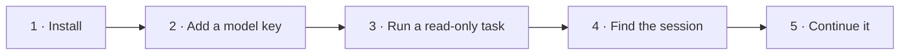

# Quickstart

Go from nothing to your first Garuda run in about five minutes. You will
install Garuda, add a model key, run a read-only task, and open the saved
session.

<p class="gd-facts">Needs: Python 3.12+, Git, and an API key for a model provider ·
Runs read-only</p>



## 1. Install

=== "macOS / Linux"

    ```bash
    git clone https://github.com/Darshan2104/Garuda-openagent.git
    cd Garuda-openagent
    python3.12 -m venv .venv
    source .venv/bin/activate
    python -m pip install -e .
    garuda --help
    ```

=== "Windows (PowerShell)"

    ```powershell
    git clone https://github.com/Darshan2104/Garuda-openagent.git
    cd Garuda-openagent
    py -3.12 -m venv .venv
    .venv\Scripts\Activate.ps1
    python -m pip install -e .
    garuda --help
    ```

If `garuda --help` lists the commands, you are ready.

??? note "Optional extras"

    | Install | Adds |
    |---|---|
    | `pip install -e ".[docs]"` | PDF and spreadsheet readers |
    | `pip install -e ".[tui]"` | Rich terminal output |
    | `pip install -e ".[eval]"` | Harbor benchmark integration |
    | `pip install -e ".[observability]"` | OpenTelemetry export |
    | `pip install -e ".[site]"` | MkDocs, to build these docs |
    | `pip install -e ".[dev]"` | pytest, for contributors |

## 2. Add a model key

The built-in default model is `openrouter/deepseek/deepseek-v4-flash-0731`, so
the simplest start is an [OpenRouter](https://openrouter.ai/) key:

```bash
export OPENROUTER_API_KEY=sk-or-...   # placeholder: use your own key
```

To use another provider, set `GARUDA_MODEL` to a
[LiteLLM model name](https://docs.litellm.ai/docs/providers) and export that
provider's key:

| Provider | `GARUDA_MODEL` | Key variable |
|---|---|---|
| OpenRouter (default) | leave unset, or `openrouter/<vendor>/<model>` | `OPENROUTER_API_KEY` |
| Anthropic | `anthropic/<model-id>` | `ANTHROPIC_API_KEY` |
| OpenAI | `openai/<model-id>` | `OPENAI_API_KEY` |
| Any other LiteLLM provider | `<provider>/<model-id>` | The variable that provider documents |

You can also choose a model for a single run with `--model provider/model`.

!!! warning "Cost and data"
    Model calls can cost money. The task text, and whatever the agent reads
    (file contents, command output), is sent to the model provider. Don't
    start in a directory that holds secrets you don't want to share with that
    provider.

## 3. Run a read-only task

With the virtual environment still active, go to any project you want to
understand and run:

```bash
cd /path/to/your/project
garuda run --mode readonly -t "Summarize this repository and identify its main entry points"
```

You will see:

1. a line such as `[garuda] reasoning=<model> (...)`, naming the model in use;
2. the agent's final answer;
3. an exit status of `0` on success, or non-zero if the run failed.

!!! info "What read-only means"
    `--mode readonly` blocks Garuda's file-writing tools and any shell command
    that isn't a plain inspection command. It is a guardrail with
    [known gaps](safety-and-workspaces.md#read-only-mode-limits), not a sandbox.
    To run untrusted code, use a
    [Docker workspace](../use-cases/change-code.md#run-untrusted-code-in-docker).

## 4. Find the saved session

Every `garuda run` is saved as a session. List the recent ones:

```bash
garuda sessions
```

The table shows each session's ID prefix, status, turn count, update time, and
task. The files live under `~/.agent/sessions/<id>/`; set `GARUDA_SESSIONS_DIR`
to store them somewhere else.

```text
~/.agent/sessions/<id>/
├── meta.json      # task, model, agent, workspace, status, timestamps
├── messages.json  # the conversation, used to resume
└── events.jsonl   # append-only log of everything that happened
```

## 5. Continue the conversation

Ask a follow-up that builds on the last run:

```bash
garuda run --mode readonly --resume latest -t "Now explain how the tests are organized"
```

`--resume` takes `latest`, a full session ID, or a unique prefix from
`garuda sessions`. Garuda starts a new session linked to the old one, so the
original record is never overwritten.

## You're set up. What next?

<div class="grid cards" markdown>

-   :material-stairs: **Try the use cases**

    ---

    Short, copy-paste recipes ordered from easy to hard.

    [:octicons-arrow-right-24: Use cases](../use-cases/index.md)

-   :material-console: **Build a command**

    ---

    Click through choices and copy a ready-to-run command.

    [:octicons-arrow-right-24: Command builder](command-builder.md)

-   :material-lightbulb-on-outline: **Understand the model**

    ---

    Runtimes, workspaces, modes, and sessions in one page.

    [:octicons-arrow-right-24: How Garuda works](how-garuda-works.md)

-   :material-lifebuoy: **Something went wrong?**

    ---

    Common install, key, and workspace problems.

    [:octicons-arrow-right-24: Troubleshooting](../reference/troubleshooting.md)

</div>
