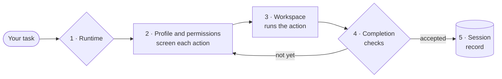
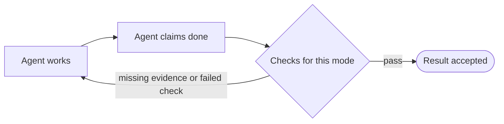

# How Garuda works

Garuda is the **runtime around a coding agent**. You give it a task. It decides
who does the work, where commands run, what the agent may do, when the work
counts as done, and it records everything in a session.

Click a step to jump to its explanation.

An external (ACP) harness replaces steps 2–4 with its own process and
authority. Garuda still records the session, but does not verify the result.

## 1. Runtime: who does the work

| | Native (default) | External harness (ACP) |
|---|---|---|
| Who drives | Garuda's own model-and-tool loop | Claude Code, Codex, Cursor, OpenCode, Pi, or Goose |
| Credentials | An API key for your model provider | Your own login to the vendor's CLI |
| Permission rules | Enforced by Garuda on every tool call | The harness acts with its own authority |
| "Done" means | Garuda's completion checks accepted the result | The harness ended its turn. Garuda does **not** verify it |
| Recorded | Messages, events, baseline, workspace delta, metrics | Normalized events, baseline, and workspace delta |

Pick one with `--runtime`. Without it, Garuda uses `native` unless trusted
routing rules choose otherwise. See [External harnesses](external-harnesses.md).

## 2. Profile and permissions: what the agent may do

A **profile** bundles tools, permission rules, and a system prompt. Choose one
with `--agent`.

| Profile | Use it to… | Can edit files? |
|---|---|---|
| `build` (default) | implement changes and run commands | Yes |
| `plan` | analyse and produce a plan | No |
| `explore` | search and read a codebase quickly | No |
| `reviewer` | review code and report findings | No |
| `harbor` | run benchmarks inside an isolated container | Yes, unrestricted. Use only inside isolation |

Every tool call passes through the **permission mode**:

| Permission mode | Behavior |
|---|---|
| `smart` | Applies tool, path, and command rules. Refuses dangerous commands; asks for risky ones such as `sudo` or recursive `rm` |
| `readonly` | Allows inspection tools and side-effect-free shell commands; denies Garuda's write tools |
| `auto` | Allows every request; only per-tool `tool_rules` still apply (currently the same as `yolo`) |
| `yolo` | Allows every request; only per-tool `tool_rules` still apply. Use only inside a boundary you trust independently |

In `garuda run`, nobody is there to answer an "ask", so it is denied and
recorded. `garuda chat` and the dashboard show you the prompt instead.

A subagent started with `invoke_subagent` runs with **its own** profile's
permission mode, not its parent's. See
[read-only limits](safety-and-workspaces.md#read-only-mode-limits).

## 3. Workspace: where commands run

`--workspace` picks the project directory. `--workspace-kind` picks how
commands are executed in it.

| Kind | Commands run… | Isolation |
|---|---|---|
| `local` (default) | on your machine, as you | None: permission rules are guardrails only |
| `tmux` | on your machine, in a visible tmux session | None |
| `sandbox` | under Bubblewrap or macOS Seatbelt | Limits writes and network. Does **not** stop host file reads |
| `docker` | in a local container, project at `/workspace` | Yes, for workspace commands. The documented boundary for untrusted code |
| `remote` | in a container on another Docker host | Docker boundary on that host |

!!! warning "Some things always run on the host"
    The workspace kind governs the agent's commands. Garuda itself, model calls,
    MCP servers, `web_fetch` and `web_search`, and any project tools or hooks you
    enabled still run on the host, outside the workspace.

## 4. Run mode: when work counts as done

Native Garuda does not accept "I'm done" on the model's word. The run mode
chooses which checks apply before a result is accepted.

| `--mode` | Checks | Extra model cost |
|---|---|---|
| `interactive` (default) | Local structural checks | None |
| `readonly` | Same as interactive, with permissions forced read-only | None |
| `eval` | Acceptance criteria, LLM judge, and discriminating, stable evidence | About two calls per completion attempt |
| `rigorous` | Eval checks plus a plan → execute → critique → repair cycle | More than eval |

`standard` is an alias for `interactive`. An explicit `--permission-mode`
overrides the permissions a mode or profile would pick.

## 5. Session: what gets recorded

Each `garuda run` or `garuda chat` creates a session under
`~/.agent/sessions/<id>/` with metadata, the conversation, and an append-only
event log. Use it to:

- list runs with `garuda sessions`;
- continue one with `--resume latest` (or an ID prefix);
- browse it with `garuda web --read-only`;
- export events with `--trajectory run.jsonl`.

Garuda also records the workspace's starting state, so the changes a session
made can be told apart from changes that were already there.

## Glossary

ACP
:   Agent Client Protocol. How Garuda launches and talks to external coding
    harnesses.

Collection model
:   An optional second, cheaper model that runs bounded, read-only
    investigation jobs for the main model. Off unless settings enable it and a
    collection model is bound.

Handoff
:   Moving a saved native session to an external harness, as a reviewed,
    one-shot transaction.

Lease
:   Garuda's lock on a workspace, so two sessions can't make overlapping
    changes. Taken by `garuda run`, `serve` jobs, the SDK's
    `SoftwareAgent.run`, and runtime commands. `garuda chat`, dashboard chats,
    and recipes don't take one yet.

MCP
:   Model Context Protocol. Lets Garuda use tools from external MCP servers.

Profile
:   A named bundle of tools, permission rules, and prompt, chosen with `--agent`.

Recipe
:   A YAML file of steps, each run by a profile, with parameters.

Skill
:   A `SKILL.md` file of instructions that the agent can load when relevant.

Trajectory
:   A JSONL export of a run's events, used for evaluation.
