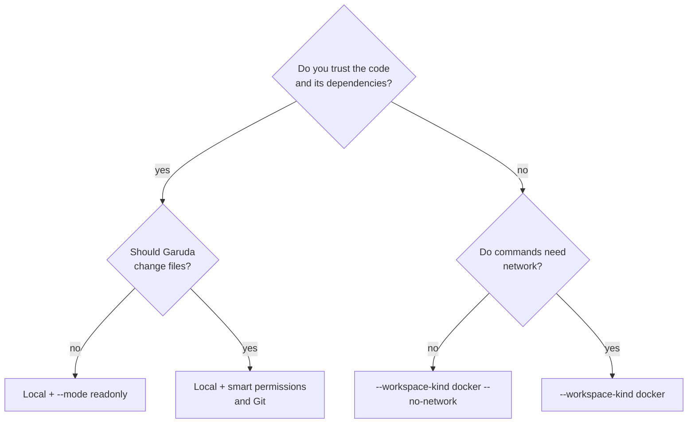

# Safety and workspaces

Garuda has several controls, and they don't give the same guarantee. Choose the
workspace boundary first, then the run and permission modes for behavior inside
it.

!!! abstract "At a glance"
    - **Docker is the isolation boundary** Garuda documents for untrusted
      workspace commands. Every other control is a guardrail.
    - Garuda itself, model calls, MCP servers, `web_fetch`/`web_search`, and any
      project tools or hooks run on the host, even with a Docker workspace.
    - Permission rules and read-only mode screen what the agent **asks** to do.
      They don't confine the process, and read-only has
      [known gaps](#read-only-mode-limits).
    - The OS sandbox limits writes and network. It does **not** stop host reads.
    - Model traffic always leaves from the host, whatever the workspace.
    - External (ACP) harnesses act with their own authority.

## Choose a posture



| Situation | Recommended posture |
|---|---|
| Inspect a repository you trust | `--mode readonly` in a local workspace |
| Modify a repository you trust | Local workspace with `smart` permissions and Git |
| Run untrusted repository code | Docker workspace, preferably without network |
| Keep a visible host terminal | tmux workspace; treat it like local execution |
| Use another Docker host | Remote workspace, after verifying the daemon and mount path |
| Launch an external coding harness | Review the [ACP authority limits](#dashboard-and-external-runtimes) first |

```bash
garuda run --workspace /path/to/project --mode readonly -t "Map the project without changing it"
```

Model access is a separate trust decision. Task text and tool results can reach
the selected provider even when workspace writes and command networking are
disabled.

## Controls and guarantees

| Control | What it does | What it does not do |
|---|---|---|
| Docker workspace | Runs workspace commands in a resource-limited container | Contain Garuda itself, model traffic, MCP servers, or web tools, which run on the host |
| Remote workspace | Runs commands in a container through another Docker daemon | Establish trust in that daemon, or provision its mount path |
| `sandbox` workspace | Uses Bubblewrap or macOS Seatbelt to reduce write and network reach | Confine general host reads |
| Permission rules | Screen tool names and literal path and command arguments | See shell expansion, or everything a broad read returns |
| `readonly` mode | Denies Garuda's write tools and shell commands not classified as side-effect-free | Act as a sandbox, or hold MCP tools to read-only |
| Workspace lease | Refuses a second editor of a workspace across `garuda run`, `garuda chat`, dashboard chats, `serve`, the SDK, recipes, and runtime sessions | Isolate the process |

Permission rules and OS sandbox policies are useful defense in depth. Don't
describe or treat them as equivalent to containment.

Configured runtime capacity is shared across launch paths. A second launch
cannot bypass it by reusing an active session id, even in another workspace.
Garuda refuses a live or unknown owner rather than replacing its reservation.
Do not delete ownership records to force a new run; close the original run or
use the documented recovery path when its owner has ended.

Workspace lease acquisition refuses an existing session id, even for a
read-only request. Renew or explicitly delegate the issued lease instead of
reacquiring it. Library callers keep the successful issuing `LeaseStore`
instance for heartbeat and release: a new instance can inspect records but
cannot recreate authority from a session id or copied epoch, and a fork cannot
inherit the parent's authority. Mutation also refuses changed owner/workspace/
mode bindings and duplicate holders. Unknown creator identity refuses before
publication. This ownership check adds no descendant cleanup or recovery receipts.

Borrowed capabilities validate the parent's current issuing-store/process
binding before creation and each acquisition/start/race call. A cached guard
refuses after parent release, source disappearance or disagreement, unknown
identity, and fork inheritance. `LeaseStore.validate_issued` performs that check
under the store lock without heartbeat renewal or new authority. Ordinary
borrowing leaves parent lease bytes unchanged. Checks before use do not replace
supervision of already-running descendants or supervised cleanup receipts.

Recovery-facing global/session lease inspection includes every retained holder,
including an expired lease with a confirmed dead parent. Ordinary records have
no complete descendant-cleanup receipt. Runtime recovery refuses before session
changes, and project-key recovery refuses before staging or publishing a new
key. `garuda doctor` continues to show the retained stale ownership. Parent death
or waiting out the TTL does not remove this refusal; complete supervised cleanup
and recovery receipts remain separate work.

Lease TTL and parent death do not authorize automatic workspace takeover:
ordinary records contain no complete descendant-cleanup receipt. A mutating
holder remains recorded and blocks another editor until explicit issuing-owner
release. Read-only registration preserves existing holders. Historical records
remain inspectable; supervised recovery/removal of a dead issuer's lease is
separate work. Do not delete records to force a new run.

When descendant death cannot be proved, the shared guard quarantines the run:
renewal stops, but the workspace lease and runtime slot stay reserved through
later close/release calls. A borrowed flow step also quarantines its parent and
retains its own slot. Capability revocation does not clear quarantine. Do not
remove records to force reuse; supervised cleanup and recovery receipts remain
separate work. This guardrail does not provide OS confinement or prove that
arbitrary descendants have exited.

## Local and tmux workspaces

`local` runs tools as you, in the selected directory. `tmux` does the same
through a visible tmux session. Both can reach anything your user can, unless
a permission rule refuses the literal request.

- Keep the workspace in version control and check existing changes before a
  run.
- Don't use a broad directory, such as your home directory, as the workspace.
- Garuda records the starting state, so the session's work stays separate from
  changes that were already there.

```bash
garuda run --workspace /path/to/project --workspace-kind tmux --permission-mode smart -t "Run the tests and fix the failure"
```

## OS sandbox workspace

The `sandbox` kind uses the available OS backend and refuses to start when
there isn't one.

```bash
garuda run --workspace . --workspace-kind sandbox --mode readonly -t "Inspect this project"
garuda run --workspace . --workspace-kind sandbox --allow-network -t "Fetch dependencies and run the tests"
```

- Network for sandboxed commands is **denied** by default. `--allow-network`
  permits it for one run.
- `--allow-unsandboxed` turns an unavailable-backend refusal into unconfined
  host execution. It is an availability escape hatch, not a fallback boundary.
- macOS Seatbelt restricts writes and network by policy but can't safely
  confine general host reads.
- On Linux, availability can depend on user-namespace and host security
  settings.

## Docker workspace

Use a local Docker workspace for untrusted code:

```bash
garuda run --workspace . --workspace-kind docker --docker-image python:3.12 --no-network -t "Run the test suite"
```

| Setting | Default | Change with |
|---|---|---|
| Mount point | `/workspace` | — |
| Image | `ubuntu:22.04` | `--docker-image` |
| Memory | 2 GiB | `--docker-memory` |
| CPUs | 2 | `--docker-cpus` |
| Network | Bridged | `--no-network` switches to Docker's `none` network |

These network flags govern commands inside the workspace. They don't stop
Garuda itself from calling the model provider, or `web_fetch` and `web_search`
from fetching pages, so don't use them to claim the agent is offline.

MCP servers start on the host, and Garuda discovers a repository's own
`.agent/mcp.json` or `.cursor/mcp.json` automatically. For an untrusted
repository, point `--mcp-config` at an empty config outside it:

```bash
echo '{}' > ~/empty-mcp.json
garuda run --workspace . --workspace-kind docker --no-network --mcp-config ~/empty-mcp.json -t "Run the test suite"
```

## Remote Docker workspace

The `remote` kind sends Docker commands to `--docker-host` or `DOCKER_HOST`:

```bash
garuda run --workspace /srv/project --workspace-kind remote --docker-host ssh://builder.example --no-network -t "Run the test suite"
```

- Garuda passes the resolved workspace path as a bind mount. That path must
  exist **on the daemon's host**; Garuda does not copy files there.
- Docker authentication and transport trust stay with the Docker CLI.
- A Docker daemon is a privileged control surface. Use only a daemon and an
  SSH or TLS setup you trust.

## Run modes and permission modes

Run mode chooses completion checks. Permission mode decides how tool requests
are screened. Settings apply in this order, later ones winning: configuration
defaults, the run-mode preset, explicit profile fields, then explicit CLI flags.
`--mode readonly` forces read-only permissions over a profile, but a later
explicit `--permission-mode` still wins.

| Permission mode | Behavior |
|---|---|
| `smart` | Applies tool, path, and command rules; refuses dangerous commands and asks for risky ones |
| `readonly` | Allows inspection tools and side-effect-free shell commands; denies Garuda's write tools. Ignores `bash_rules` |
| `auto` | Allows every request. Only per-tool `tool_rules` apply; path rules, bash rules, and built-in refusals are skipped (currently the same as `yolo`) |
| `yolo` | Same as `auto`. Use only inside a boundary you trust independently |

!!! warning
    Don't combine `--mode readonly` with a more permissive `--permission-mode`
    and still call the result read-only.

Path checks inspect literal arguments. Shell wildcards, indirection, and broad
commands can return content from paths that weren't named. Use a read-only
mount, a minimal copy of the workspace, or a container when that matters.

### Read-only mode limits

`--mode readonly` and the `readonly` permission mode are guardrails with known
gaps today:

- **Subagents.** A subagent can't do more than the run that started it.
  Every call it makes must pass both its own profile's rules and its parent's
  effective permissions (including `--permission-mode`, the dashboard's
  `--max-permission` ceiling and any ancestor's rules); the stricter decision
  wins, and an approval is asked once through the parent. A subagent also uses
  only tools its parent already has: it never opens its own MCP connections.
- **MCP tools.** MCP tools are added to every profile and aren't treated as
  writes, so a write-capable MCP tool still runs.
- **Environment variables.** `env` and `printenv` count as inspection
  commands, so environment variables, including API keys, can reach the model.

When nothing may change, use `--agent explore` with an empty `--mcp-config`,
work on a disposable copy of the project, and check `git status` afterwards.

## Trusted configuration and executable extensions

A repository may provide profiles, skills, project instructions, and MCP
configuration under `.agent/`. It may **not** authorize its own Python tools or
hooks, because enabling either runs repository code:

```yaml
# ~/.agent/settings.yaml
trust_project_hooks: true
load_project_tools: true
```

Two more limits apply without any setting:

- **Profile permissions.** A profile inside the project may not set a
  `permission_mode` above the user's ceiling (`smart` unless you raise it):

  ```yaml
  # ~/.agent/settings.yaml
  agents:
    project_ceiling: smart   # readonly | smart | auto | yolo
  ```

  An explicit `--permission-mode` is your choice and is used as given.
- **Project MCP servers.** A server defined by the project's own config starts
  only after `garuda mcp trust` records your trust in that exact entry for that
  repository. Changing the entry, a script it runs, or a symlink it uses asks
  again. The grant selects configuration; it doesn't prove what the server does.

Before enabling a cloned project, review `.agent/tools/`, hook commands, profile
permissions, project MCP server commands, and root `AGENTS.md` or `GARUDA.md`.

Trusted global settings own runtime launch commands and routing policy. Project
settings can refer to approved runtime IDs but can't define executable runtime
commands.

## Dashboard and external runtimes

The dashboard binds to loopback, uses a capability token, and picks workspaces
from a server-side allowlist. Start it history-only when that's all you need:

```bash
garuda web --read-only
```

For live conversations, repeat `--allow-workspace` for each allowed directory
and set `--max-permission` as the browser's ceiling. A browser request can ask
for that posture or a stricter one, never a looser one. Subagents started by
that run stay within the same ceiling.

ACP runtimes are different from native workspace execution. Garuda launches the
user-authenticated harness and records approvals, session state, leases, and
workspace evidence. It does **not** enforce native tool permissions or
completion checks inside that harness, which edits and runs commands with its
own authority. Read [External harnesses](external-harnesses.md) before using
one with untrusted code.

## Pre-run checklist

- [ ] Select the smallest workspace that does the job.
- [ ] Check existing Git changes, and secrets, in that workspace.
- [ ] Decide whether host execution is acceptable; otherwise choose Docker.
- [ ] Decide whether workspace commands need network access.
- [ ] Start with `readonly` or `smart`, not a permissive override.
- [ ] Review project hooks, Python tools, MCP commands, and instructions. For an
      untrusted repository, pass an empty `--mcp-config`.
- [ ] Confirm the native or ACP runtime and its credential boundary.
- [ ] Afterwards, inspect the session, workspace changes, and verification status.

## No-edits runs (a guardrail, not confinement)

`garuda run --no-edits`, or a role with `write_policy: no-edits`, asks a run
not to change the workspace. Its requests to edit files or run mutating
commands are refused: a native run gets the `readonly` ceiling, and an
external harness's approval requests are denied and recorded.

Nothing stops a process from writing anyway, so Garuda checks afterwards.
Once the run and everything it started have exited, it compares the workspace
with a manifest taken before: every file, ignored ones included, with its
mode, symlink target and change time, plus the repository's refs, `HEAD`,
hooks, config and staged entries. If anything differs, or the comparison
could not be completed, the run reports **changes detected**, withholds its
output, exits with status 3, and records which paths changed. Nothing is
reverted: the changes stay for you to inspect. Only a complete, identical
comparison reports **no changes detected**.

## Read-only external harnesses run in Docker

A role for an external harness (Claude Code, Codex, …) with
`permissions: readonly` runs only inside a Docker container that Garuda has
just proved is confined:

- your workspace is mounted read-only, and writing into it or its `.git`
  fails;
- a bounded scratch directory is writable;
- the container user is not root and has no capabilities;
- no Docker socket, home directory, credential store or other workspace is
  mounted.

The harness inside the image must be one you installed and logged in to
there yourself; Garuda passes no host credential in. Name the image in your
user `garuda.yaml`:

```yaml
harnesses:
  claude:
    confinement:
      image: my-claude-acp:latest
      command: [claude-agent-acp]   # optional; the manifest's command otherwise
```

Without a configured image, without Docker, or if the proof fails, the run
refuses with `workspace.readonly_unenforced`. Garuda never runs such a role
on the host instead, in a worktree or under the no-edits guardrail. This
setting is user-only; a project file cannot add or change it.
