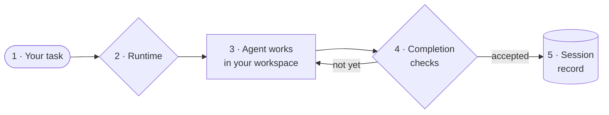

---
hide:
  - navigation
  - toc
---

<div class="gd-hero" markdown>

# Garuda

A safe, inspectable runtime for AI coding agents. Give it a task and it runs
a model, or an external agent such as Claude Code or Codex, in a workspace you
choose. It screens what the agent may do, checks the result, and records
everything so you can inspect or continue it.

[Get started in 5 minutes](guides/getting-started.md){ .md-button .md-button--primary }
[Browse use cases](use-cases/index.md){ .md-button }

</div>

## Try it

```bash
git clone https://github.com/Darshan2104/Garuda-openagent.git && cd Garuda-openagent
python3.12 -m venv .venv && source .venv/bin/activate && pip install -e .
export OPENROUTER_API_KEY=sk-or-...   # placeholder: use your own key
garuda run --mode readonly -t "Summarize this repository"
```

The last command only reads: it can't edit files. Model calls can cost money.

## How a run works

Click a step to learn more.



With Garuda's native agent, every tool call in step 3 is screened by
permission rules. With an external harness such as Claude Code, the harness
does step 3 with its own authority and step 4 is skipped: Garuda records the
result but does not verify it.

## Find your way

<div class="grid cards" markdown>

-   :material-rocket-launch: **Quickstart**

    ---

    Install, add a key, run a read-only task, and find the session.

    [:octicons-arrow-right-24: Start here](guides/getting-started.md)

-   :material-stairs: **Use cases, easy to hard**

    ---

    "I want to… → run this" recipes in five levels, from reading code to
    handing sessions to Claude Code.

    [:octicons-arrow-right-24: Use cases](use-cases/index.md)

-   :material-console: **Command builder**

    ---

    Click through your goal, workspace, and agent to get a ready-to-run
    command.

    [:octicons-arrow-right-24: Build a command](guides/command-builder.md)

-   :material-lightbulb-on-outline: **How Garuda works**

    ---

    Runtimes, workspaces, profiles, modes, and sessions on one page.

    [:octicons-arrow-right-24: Concepts](guides/how-garuda-works.md)

-   :material-shield-check: **Safety and workspaces**

    ---

    What each control does and does not protect, and when to use Docker.

    [:octicons-arrow-right-24: Safety](guides/safety-and-workspaces.md)

-   :material-file-document-outline: **Cheat sheet**

    ---

    Every everyday command on one page, ready to copy.

    [:octicons-arrow-right-24: Cheat sheet](reference/cheat-sheet.md)

</div>

## What you get

| Capability | Details |
|---|---|
| **Any model** | Any LiteLLM provider, with retries, streaming, reasoning settings, prompt caching, and cost accounting |
| **Real tools** | Shell, files, edits, search, PDFs and spreadsheets, web fetch, MCP servers, skills, subagents, and your own Python tools |
| **Guardrails** | Profiles, permission rules, read-only mode, and approvals for risky actions |
| **Isolation** | Docker or remote Docker workspaces for untrusted code, or an OS sandbox that limits writes and network |
| **Evidence, not claims** | Completion checks that require proof before a native result counts as done |
| **Sessions** | Every run saved, resumable, and viewable in a local dashboard |
| **External harnesses** | Claude Code, Codex, Cursor, OpenCode, Pi, and Goose through ACP, with handoff and recovery |
| **Many interfaces** | CLI, interactive chat, web dashboard, YAML recipes, Python SDK, and a JSON-RPC service |

## Contributing

Read the [Architecture](ARCHITECTURE.md), the [Module map](MODULES.md), and the
[Development guide](development/development.md). Coding agents should start
with the
[contributor guide](https://github.com/Darshan2104/Garuda-openagent/blob/main/AGENTS.md).
Open work is in the [backlog](BACKLOG.md); dated designs and plans are under
**Project history**.
