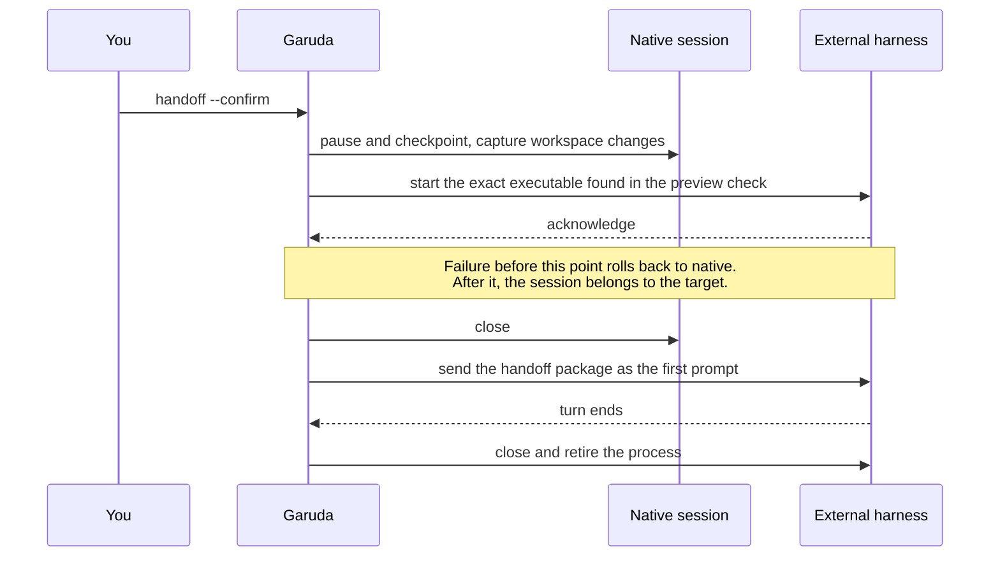
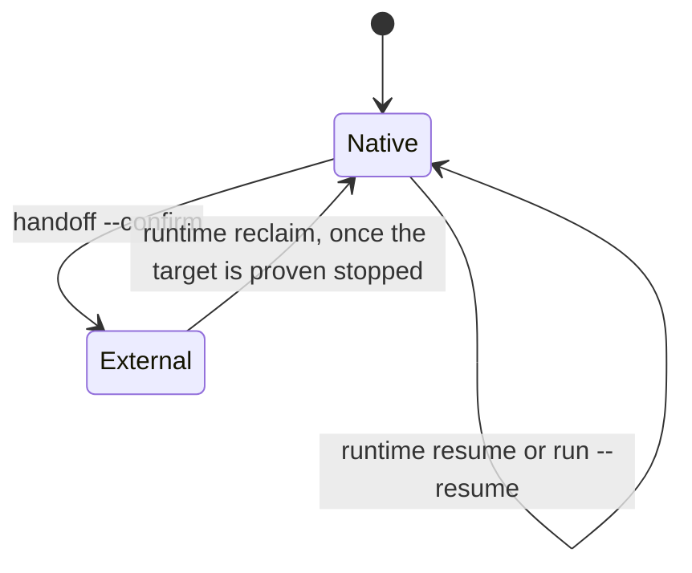
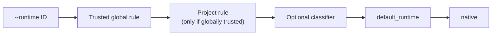

# Level 5 · Advanced

<span class="gd-level">Level 5</span> Use subscription-backed coding harnesses
through ACP, move sessions between runtimes, choose runtimes automatically,
and add a second model.

!!! danger "External harnesses are not confined by Garuda"
    An external harness runs as **its own process on your machine** with its
    own permissions. Garuda's run modes, permission rules, Docker and sandbox
    workspaces, and completion checks do not apply to it. Garuda records the
    session, approvals, and workspace changes. "Completed" means the harness
    ended its turn, not that Garuda verified the result.

## See which external harnesses are ready

<p class="gd-facts">Changes files: no</p>

```bash
garuda runtime list
garuda runtime inspect claude
```

**What happens:** Garuda checks each entry in its trusted catalog (`claude`,
`codex`, `cursor`, `opencode`, `pi`, `goose`): is the executable installed,
what version it is, what it can do, and setup hints. Login and quota show as
`unknown` unless the vendor reports them; Garuda never reads credential files to
find out. Add `--json` for machine-readable output.

### Install a harness

You install and log in to each vendor's CLI yourself. Garuda launches it but
never reads, copies, stores, or proxies your vendor login.

=== "Claude Code"

    Needs Node.js 20+ and Claude Code, installed and logged in.

    ```bash
    npm install -g @agentclientprotocol/claude-agent-acp
    claude-agent-acp --version
    garuda runtime inspect claude
    ```

    Don't set `ANTHROPIC_API_KEY` if you want to use your subscription.

=== "Codex"

    Needs Node.js 20+ and the Codex CLI.

    ```bash
    codex login
    npm install -g @agentclientprotocol/codex-acp
    codex-acp --version
    garuda runtime inspect codex
    ```

=== "OpenCode"

    ```bash
    npm install -g opencode-ai
    opencode --version
    garuda runtime inspect opencode
    ```

    Log in through OpenCode's own configuration.

=== "Cursor"

    Install and log in to the Cursor Agent CLI, then:

    ```bash
    agent --version
    garuda runtime inspect cursor
    ```

=== "Pi"

    Install the `pi-acp` package and log in to Pi, then:

    ```bash
    pi-acp --version
    garuda runtime inspect pi
    ```

=== "Goose"

    Install and log in to Goose, then:

    ```bash
    goose --version
    garuda runtime inspect goose
    ```

Details and limits for each vendor are in the
[External harnesses guide](../guides/external-harnesses.md#vendor-setup).

## Run a task with Claude Code, Codex, or another harness

<p class="gd-facts">Changes files: yes, by the harness · Runs on: your machine · Needs: the vendor CLI</p>

```bash
garuda run --runtime claude -t "Add type hints to src/utils.py"
```

**What happens**

1. Garuda resolves the trusted catalog entry. An unknown, disabled, or
   missing runtime is refused.
2. It locks the workspace, records a session and the starting state, and
   launches the exact executable it found.
3. Approval requests from the harness reach you as a `y/N` prompt on an
   interactive terminal. In a headless run they are denied and recorded.
4. When the harness ends its turn, Garuda records the workspace changes and
   stops the process.

If an installed harness fails to **start** and the workspace is unchanged,
Garuda moves the session once to `fallback_runtime` (native by default) and
records why in the session. The native run then uses your model API key.

## Hand off a Garuda session to an external harness

<p class="gd-facts">Changes: session ownership · Preview first, then confirm</p>

**Use it when** a native session has done the groundwork and you want a
harness to continue it.

```bash
garuda runtime handoff --session latest --to codex
garuda runtime handoff --session latest --to codex --confirm
```

The first command only previews. The second runs a one-shot transaction:



The handoff package holds bounded task state, evidence references, and the
workspace changes. It never contains vendor credentials, raw secrets, or the
full transcript. Add `--workspace DIR` if the session recorded a relative
path and you're running from somewhere else.

## Recover or take back a session

<p class="gd-facts">Changes: session ownership only</p>

**Use it when** a run was interrupted, or a harness finished and you want
Garuda's native loop to continue.



```bash
garuda runtime recover --session latest
garuda runtime reclaim --session latest
garuda runtime resume --session latest -t "Continue after the external run"
```

- `recover` classifies the session as `resumable`, `rolled_back`, or
  `external` (owned by a harness that may still be acting).
- `reclaim` returns an `external` session to native. It refuses while a
  workspace lock, a live recorded process, or an active target state says the
  harness might still be running. It repairs ownership; it does not undo the
  harness's changes.
- `resume` continues a native session with a new task.

Need help from someone else? `garuda runtime support --session latest` prints a
redacted diagnostic bundle without raw event payloads.

## Route tasks to runtimes automatically

<p class="gd-facts">Configured in: <code>~/.agent/settings.yaml</code> (trusted, global)</p>

**Use it when** certain kinds of tasks should always start on a particular
runtime.

```yaml
# ~/.agent/settings.yaml
routing:
  default_runtime: native
  rules:
    - id: readonly-review
      priority: 100
      runtime: codex
      when:
        agents: [reviewer]
        modes: [readonly]
```

Garuda picks the starting runtime from the first source that applies:



`--runtime native` counts as no choice, so rules can still pick another
runtime. Every condition in a rule must match; higher `priority` wins. An optional
classifier model can pick between approved candidates when no rule matches.
Its answer is re-checked, and on any doubt the default is used. See
[Configuration → initial runtime selection](../guides/configuration.md#initial-runtime-selection).

## Add a cheaper model for investigation

<p class="gd-facts">Configured in: <code>~/.agent/settings.yaml</code> · Off by default</p>

**Use it when** the main model spends many turns reading and searching, and a
faster model could gather evidence in parallel.

```yaml
# ~/.agent/settings.yaml
models:
  strong:
    model: openrouter/example/reasoning
  fast-reader:
    model: openrouter/example/fast-reader
model_bindings:
  default:
    reasoning: strong
    collection: fast-reader
model_bindings_default: default
collection:
  enabled: true
  profile: explore
  handoff: brief
```

**What happens**

- Settings in a profile or project can also turn collection on, and a
  collection model must be bound.
- The main model stays in control and must explicitly call
  `delegate_collection`. Collection jobs are bounded and read-only; they can't
  edit files or finish the task.
- Each job's full trace is saved under the parent session's `subagents/`
  folder.
- `--no-collection` turns the role off for one run.

Budgets and evidence rules: [Configuration → bounded collection model](../guides/configuration.md#bounded-collection-model).

## Use Garuda from an ACP editor

<p class="gd-facts">Garuda acts as the agent side of an ACP session over stdio</p>

```bash
python -m garuda.acp.server --workspace /path/to/workspace
```

Point an ACP-capable editor at this command to use Garuda's native agent from
the editor.

## Benchmark and evaluate

<p class="gd-facts">For: measuring Garuda, not day-to-day work</p>

```bash
garuda run --mode eval --trajectory run.jsonl -t "Make the failing tests pass"
```

`--mode eval` applies the benchmark-grade completion checks, and
`--trajectory` saves the run's events for analysis. For benchmark setups and
paired dual-model reports (`garuda eval dual-model report ...`), see
[Evaluation](../evaluation/index.md).
