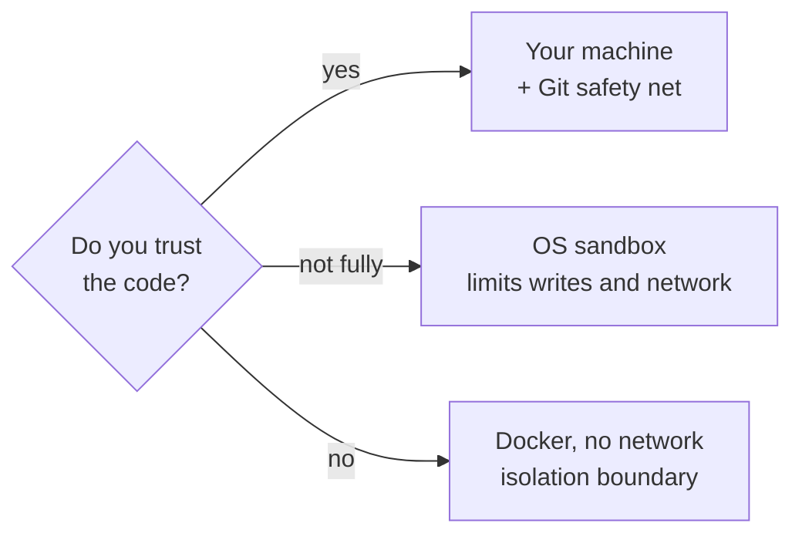

# Level 2 · Change code

<span class="gd-level">Level 2</span> Garuda edits files and runs commands.
Start on your own machine with Git as a safety net. Move to Docker when the
code isn't yours to trust.



## Fix a bug with a Git safety net

<p class="gd-facts">Changes files: yes · Runs on: your machine · Needs: Git</p>

**Use it when** you have a known bug or failing test in a repository you trust.

```bash
git status
garuda run -t "Fix the failing test in tests/test_parser.py, then run it to confirm"
git diff
```

Start from a clean tree (or commit first) so `git diff` shows only Garuda's
work. Keep the result with `git commit`; throw it away with `git restore .`
and delete any new files that `git status` lists.

**What happens**

- The default `build` profile can edit files and run commands, including your
  tests.
- Dangerous commands, such as writing to a raw device, are refused.
- Risky commands, such as `sudo`, `chmod`, recursive `rm`, or piping a download
  into a shell, need approval. `garuda run` has nobody to ask, so they are
  denied and recorded. Use [`garuda chat`](#chat-and-approve-risky-actions-yourself)
  to approve them yourself.
- Garuda records the starting state, so the session's changes stay separate
  from edits that were already there.

## Chat and approve risky actions yourself

<p class="gd-facts">Changes files: yes · Runs on: your machine · Interactive</p>

**Use it when** you want to steer the work turn by turn.

```bash
garuda chat --workspace .
```

**What happens**

- Type a task at the `task>` prompt. The agent works, then waits for the next
  one, keeping the conversation.
- When it wants a risky action, you see
  `[garuda] Approve <action>? [y/N]`. Anything but `y` or `yes` denies it.
  The prompt appears when the profile's own permission mode is `smart`, as
  with the default `build` profile; other profiles deny asks.
- Press ++enter++ on an empty line, or ++ctrl+d++, to finish.
- Away from that terminal? While the prompt waits, you can answer it from
  another one, or from the dashboard's Approvals page. See
  [answer an approval from elsewhere](parallel.md#answer-an-approval-from-another-terminal-or-the-browser).

Add `--mode readonly` for a read-only chat, or `--agent plan` to discuss a
plan before building it.

## Work with the agent in your browser

<p class="gd-facts">Changes files: yes · Opens: a local web page</p>

**Use it when** you prefer a visual chat with live tool calls, diffs, and
approval buttons.

```bash
garuda web --allow-workspace . --max-permission smart
```

**What happens**

- The dashboard can start native conversations, but only in directories you
  listed with `--allow-workspace` (repeat the flag for more).
- A browser request can ask for `--max-permission` or something stricter,
  never looser.
- You can attach files or URLs as grounding. They are saved under `grounding/`
  in the workspace and read by the agent with its normal tools.
- If the browser abandons an approval, Garuda denies it instead of waiting
  forever.

More in the [Web dashboard guide](../guides/web-dashboard.md).

## Verify the result with your own check

<p class="gd-facts">Changes files: yes · Works with external harnesses too</p>

**Use it when** "done" should mean "your test command passes", not "the agent
says so".

```bash
garuda run --name fix-tests -t "Fix the failing tests by changing src/ only" --check "python -m pytest -q"
```

```text
[garuda] verification: passed (user-request)
```

**What happens**

- After the session ends, Garuda runs each `--check` command (repeat the flag
  for more) and records a receipt: who asked for it, the exact command, the
  code it ran against, and the result.
- The session's **verification** becomes `passed` or `failed`. It is kept
  apart from the agent's own **self-check**, so `garuda sessions show
  fix-tests` shows both.
- Without a check, verification reads `unavailable`. Checks can also come
  from your `garuda.yaml` or a project file you trusted; see
  [Level 5](teams.md#require-checks-for-every-run-in-this-project).
- A check can't pass if it changes the code it checks, or if the session
  changed the test setup it relies on (for example `conftest.py` for pytest).

## Make Garuda prove the fix

<p class="gd-facts">Changes files: yes · Costs: extra model calls</p>

**Use it when** "it says it's done" isn't good enough and you want the agent
to gather evidence before it stops. These modes make the agent check its own
work; pair them with [`--check`](#verify-the-result-with-your-own-check) when
you also want an independent result.

```bash
garuda run --mode eval -t "Make tests/test_parser.py pass without changing the tests"
garuda run --mode rigorous -t "Fix the date parsing bug and show evidence that it is fixed"
```

| Mode | Adds before accepting "done" | Extra cost |
|---|---|---|
| `eval` | Acceptance criteria, an LLM judge, and evidence that is discriminating and stable | About two model calls per completion attempt |
| `rigorous` | Everything in `eval`, plus a plan → execute → critique → repair cycle | More than `eval` |

If a check fails, the agent goes back to work instead of finishing.

## Run untrusted code in Docker

<p class="gd-facts">Changes files: yes, inside the mounted project · Runs in: a container · Needs: Docker</p>

**Use it when** the repository, its dependencies, or its tests aren't yours to
trust.

```bash
garuda run --workspace-kind docker --docker-image python:3.12 --no-network -t "Run the test suite and summarize the failures"
```

**What happens**

- Commands run in a container with the project mounted at `/workspace`.
- `--no-network` switches the container to Docker's `none` network. Without it,
  networking is bridged.
- Default limits are 2 GiB of memory and 2 CPUs. Change them with
  `--docker-memory 4g --docker-cpus 4`.
- The default image is `ubuntu:22.04`. Pick one that already has your toolchain.

!!! warning "What Docker does not cover"
    - **The host side.** Garuda itself, model calls, `web_fetch` and
      `web_search`, and any project tools or hooks you enabled run on the host.
    - **MCP servers.** They start on the host, including ones the repository
      defines in `.agent/mcp.json` or `.cursor/mcp.json`. For an untrusted
      repository, add `--mcp-config` pointing at an empty `{}` file outside it.
    - **Offline installs.** With `--no-network` the container can't download
      dependencies. Use an image that has them, or drop `--no-network`.

??? note "Use another machine's Docker"

    ```bash
    garuda run --workspace /srv/project --workspace-kind remote --docker-host ssh://builder.example --no-network -t "Run the test suite"
    ```

    The workspace path must already exist **on the remote host**: Garuda passes
    it as a bind mount and does not copy files. Use only a Docker daemon and
    SSH or TLS setup you trust.

## Limit writes and network with the OS sandbox

<p class="gd-facts">Changes files: yes · Runs on: your machine, under Bubblewrap or Seatbelt</p>

**Use it when** you want less blast radius than plain local runs but can't use
Docker.

```bash
garuda run --workspace-kind sandbox -t "Run the tests and fix the failure"
garuda run --workspace-kind sandbox --allow-network -t "Install the dependencies and run the tests"
```

**What happens**

- Linux uses Bubblewrap and macOS uses Seatbelt to restrict writes and network.
- Network is **denied** by default. `--allow-network` permits it for one run.
- If no sandbox backend is available, Garuda refuses to start.

!!! danger "Know the limits"
    The sandbox does **not** stop the agent reading host files.
    `--allow-unsandboxed` turns the refusal into unconfined host execution. It
    is an availability escape hatch, not a safety boundary.

## Cap time, turns, and cost

<p class="gd-facts">Works with: any native run</p>

**Use it when** you want a run to stay small and predictable.

```bash
garuda run --deadline-sec 900 --max-turns 30 -t "Fix the flaky test in tests/test_cache.py"
```

- `--deadline-sec` sets a wall-clock budget. The agent paces itself against it
  and keeps turns in reserve to finish cleanly.
- `--max-turns` caps the number of agent turns.
- Check the `[garuda] reasoning=…` line at startup to confirm the model.
- Start with the default mode. `eval` and `rigorous` add model calls.
- Your provider's billing page is the authority on cost. Garuda does not guess
  missing prices.
- To see what runs actually used, open the dashboard's
  [Usage page](parallel.md#see-usage-cost-and-limits).

## Name a session and build on it

<p class="gd-facts">Changes files: depends on the task · Shares: a short brief, never the transcript</p>

**Use it when** a later task should know what an earlier one did, without you
re-explaining it.

```bash
garuda run --name fix-tests -t "Fix the failing tests"
garuda run --no-edits -t "In two sentences, explain what @fix-tests changed and why"
garuda run --with fix-tests --with add-docs -t "Write the release note for these changes"
```

```text
[garuda] tagged: fix-tests (native · openrouter/deepseek/deepseek-v4-flash-0731)
```

**What happens**

- `--name` gives the session a name that is unique in this project. Without
  it, Garuda makes one from the task. Names work anywhere a session ID does:
  `--resume fix-tests`, `garuda sessions show fix-tests`.
- `@fix-tests` in the task, or `--with fix-tests`, attaches that session's
  **brief**: its task, state, changed files, checks and final answer. The
  transcript is never attached. The brief arrives as labelled data, not as
  instructions.
- A session from another project needs its full ID, `--with-id FULL_ID`, and
  your permission: Garuda asks in a terminal, or you pass
  `--allow-cross-project-context` in a script.
- In `garuda chat`, `@name` works in any message.

!!! tip "Brief or resume?"
    `--resume` continues the conversation itself, with the full history.
    `@name` and `--with` start fresh and hand over only the brief, which keeps
    the new run's context small.

## Use a different model for one run

<p class="gd-facts">Needs: the provider's API key</p>

```bash
export ANTHROPIC_API_KEY=...   # placeholder
garuda run --model anthropic/MODEL_ID -t "Refactor utils.py into smaller functions"
garuda run --reasoning-effort high -t "Find the race condition in the job queue"
```

- Replace `MODEL_ID` with the provider's model name. `--model` accepts any
  LiteLLM `provider/model` name and beats model environment variables and
  configured bindings.
- `--reasoning-effort minimal|low|medium|high` turns on extended thinking
  across providers. `--thinking-budget TOKENS` sets an Anthropic thinking
  budget.

To change the default for every run, see [Configuration](../guides/configuration.md#models).

---

**Next:** make every run understand your project in
[Level 3 · Teach it your project](customize.md).
