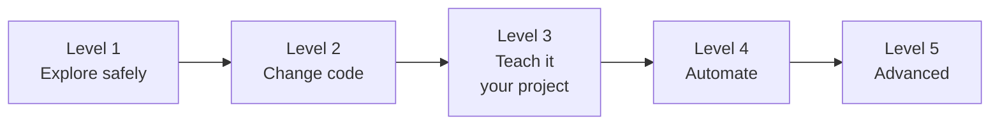

# Use cases

Short recipes ordered from **easy to hard**. Each one says when to use it, gives
a command you can copy, explains what happens, and lists what to watch for.

New to Garuda? Do the [Quickstart](../guides/getting-started.md) first, then
start at Level 1. Click a level to open it.

## Level 1 · Explore safely

Nothing in your project changes. [Open Level 1 →](explore.md)

| I want to… | Run |
|---|---|
| [Understand a codebase](explore.md#ask-questions-about-a-codebase) | `garuda run --mode readonly -t "…"` |
| [Get a review of my changes](explore.md#review-your-uncommitted-changes) | `garuda run --agent reviewer --mode readonly -t "…"` |
| [Plan a change first](explore.md#plan-a-change-before-making-it) | `garuda run --agent plan -t "…"` |
| [Ask a follow-up](explore.md#ask-a-follow-up-question) | `garuda run --mode readonly --resume latest -t "…"` |
| [Read PDFs and spreadsheets](explore.md#read-pdfs-and-spreadsheets) | `garuda run --mode readonly -t "Summarize report.pdf"` |
| [Browse past runs](explore.md#browse-past-runs-in-the-dashboard) | `garuda web --read-only` |

## Level 2 · Change code

Garuda edits files and runs commands. [Open Level 2 →](change-code.md)

| I want to… | Run |
|---|---|
| [Fix a bug, with Git as a safety net](change-code.md#fix-a-bug-with-a-git-safety-net) | `garuda run -t "…"` |
| [Approve risky actions myself](change-code.md#chat-and-approve-risky-actions-yourself) | `garuda chat` |
| [Work in a browser](change-code.md#work-with-the-agent-in-your-browser) | `garuda web --allow-workspace .` |
| [Have the fix proven](change-code.md#make-garuda-prove-the-fix) | `garuda run --mode rigorous -t "…"` |
| [Run untrusted code](change-code.md#run-untrusted-code-in-docker) | `garuda run --workspace-kind docker --no-network -t "…"` |
| [Limit writes and network](change-code.md#limit-writes-and-network-with-the-os-sandbox) | `garuda run --workspace-kind sandbox -t "…"` |
| [Cap time and turns](change-code.md#cap-time-turns-and-cost) | `garuda run --deadline-sec 900 --max-turns 30 -t "…"` |
| [Try another model](change-code.md#use-a-different-model-for-one-run) | `garuda run --model provider/model -t "…"` |

## Level 3 · Teach it your project

Project files that shape every run. [Open Level 3 →](customize.md)

| I want to… | Add |
|---|---|
| [Give standing instructions](customize.md#give-garuda-project-instructions) | `AGENTS.md` at the project root |
| [Make my own agent profile](customize.md#create-your-own-agent-profile) | `.agent/agents/<name>.yaml` |
| [Teach a repeatable procedure](customize.md#add-a-skill) | `.agent/skills/<name>/SKILL.md` |
| [Use tools from an MCP server](customize.md#connect-mcp-tools) | `.agent/mcp.json` |
| [Write my own tool in Python](customize.md#add-your-own-python-tools) | `.agent/tools/<name>.py` |

## Level 4 · Automate

Run Garuda from files, scripts, and programs. [Open Level 4 →](automate.md)

| I want to… | Use |
|---|---|
| [Chain steps (plan → build → test)](automate.md#run-a-multi-step-recipe) | `garuda recipe run fix-and-test.yaml` |
| [Run in a script or CI job](automate.md#use-garuda-in-scripts-and-ci) | `garuda run --json -t "…"` |
| [Embed in a Python program](automate.md#call-garuda-from-python) | `SoftwareAgent` |
| [Submit jobs over HTTP](automate.md#call-garuda-over-http) | `garuda serve` |

## Level 5 · Advanced

External harnesses, handoffs, routing, and a second model.
[Open Level 5 →](advanced.md)

| I want to… | Run |
|---|---|
| [See which harnesses are ready](advanced.md#see-which-external-harnesses-are-ready) | `garuda runtime list` |
| [Use Claude Code, Codex, …](advanced.md#run-a-task-with-claude-code-codex-or-another-harness) | `garuda run --runtime claude -t "…"` |
| [Hand a session to a harness](advanced.md#hand-off-a-garuda-session-to-an-external-harness) | `garuda runtime handoff --session latest --to codex` |
| [Recover after an interruption](advanced.md#recover-or-take-back-a-session) | `garuda runtime recover --session latest` |
| [Choose the runtime automatically](advanced.md#route-tasks-to-runtimes-automatically) | `routing:` in `~/.agent/settings.yaml` |
| [Add a cheaper investigation model](advanced.md#add-a-cheaper-model-for-investigation) | `collection:` in `~/.agent/settings.yaml` |
| [Benchmark and evaluate](advanced.md#benchmark-and-evaluate) | `garuda run --mode eval --trajectory run.jsonl -t "…"` |
