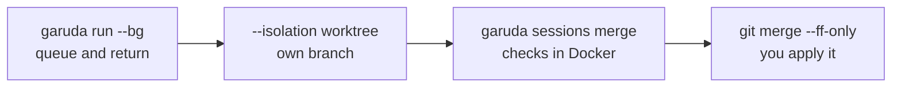

# Level 4 · Run work in parallel

<span class="gd-level">Level 4</span> Queue tasks in the background, let two
of them edit the same repository without colliding, merge the results only
after your checks pass, and watch it all from one place.



## Run a task in the background

<p class="gd-facts">Returns: at once · Follow it with: <code>garuda sessions</code></p>

**Use it when** a task takes a while and you want your terminal back.

```bash
garuda run --bg --name docstrings -t "Add a one-line docstring to every function in src/calc/__init__.py"
garuda sessions
garuda sessions show docstrings
```

```text
[garuda] queued in the background; follow it with `garuda sessions`, stop it with `garuda sessions cancel 65c48099`
65c48099-dc29-4c8d-8e87-e088d75fae9a

ID         NAME                     STATE      QUEUE    UPDATED                          TASK
65c48099   docstrings               working    -        2026-10-06T09:24:04+00:00        Add a one-line docstring to every…
```

**What happens**

- The run waits in a queue for a free slot, then a detached worker runs it.
  You can close the terminal.
- A session moves through these states:

    ```mermaid
    stateDiagram-v2
      [*] --> queued
      queued --> working: a slot is free
      queued --> cancelled: sessions cancel
      working --> waiting: needs an approval
      waiting --> working
      working --> completed
      working --> failed
      working --> cancelled: sessions cancel
      working --> crashed: worker is gone
    ```

- `garuda sessions show NAME` prints the whole record: state, outcome and
  verification (kept apart), queue position, branch, pending approvals, and
  the flow it belongs to. Add `--json` for scripts.
- The worker's own output is `worker.log` in the session's folder under
  `~/.agent/sessions/`.
- A background run has nobody to answer approvals, so an action that needs
  one is denied and recorded, as in any headless run.

Stop one with `garuda sessions cancel NAME`:

```text
[garuda] removed from the queue before it started
```

A running worker is stopped only after Garuda has matched its recorded
process, so it never signals an unrelated process.

## Let two tasks edit at once

<p class="gd-facts">Changes: a separate Git worktree · Needs: a Git repository with at least one commit</p>

**Use it when** you want a second editing task while another one is still
working, or you want a task's changes on their own branch.

```bash
garuda run --bg --isolation worktree --name docstrings -t "Add docstrings to src/calc"
garuda run --bg --isolation worktree --name usage-docs -t "Add a Usage section to README.md"
```

```text
[garuda] worked in worktree ~/.agent/worktrees/ad541ef8…/d4f715c3-… on branch garuda/d4f715c3-… (a separate checkout, not a sandbox)
[garuda] uncommitted changes in the source checkout were not carried over
[garuda] to integrate: garuda sessions merge d4f715c3 --check 'COMMAND'
```

**What happens**

- Each session gets its own linked Git worktree on a `garuda/<session>`
  branch, under `~/.agent/worktrees/`. Your checkout isn't touched.
- The worktree starts from your last commit. Uncommitted changes in your
  checkout are **not** carried over, so commit first if the task needs them.
- `--isolation auto` uses a worktree only while another session is editing
  the workspace, and edits in place otherwise.
- Without `--isolation`, a second session that wants to edit the same
  workspace is refused instead of mixing its changes with the first.
- A worktree is a separate place to edit, not confinement: the agent can still
  read and write elsewhere as you.

## Check and merge a worktree session

<p class="gd-facts">Runs checks: in Docker, no network · Changes your checkout: no</p>

**Use it when** a worktree session is done and you want its work, but only if
your checks pass on the merged result.

The checks run in a locked-down container with no network, so use an image
that already has your test tools:

```bash
printf 'FROM python:3.12-slim\nRUN pip install --no-cache-dir pytest\n' | docker build -t my-checks -
garuda sessions merge docstrings --image my-checks --check "python -m pytest -q -p no:cacheprovider"
```

```text
[garuda] check passed in Docker: python -m pytest -q -p no:cacheprovider
[garuda] integration commit 275404d5… published as refs/garuda/integration/65c48099-…
[garuda] to apply it, with master checked out:
  git -C /path/to/project merge --ff-only 275404d5…
```

Apply it yourself, then clean up:

```bash
git merge --ff-only 275404d5…
garuda sessions remove-worktree docstrings
```

**What happens**

1. Garuda snapshots the worktree, including uncommitted edits, into a commit.
2. It previews the merge into your current branch (or `--into BRANCH`) and
   refuses on conflicts.
3. It runs every `--check` (at least one is required) in Docker against the
   merged tree: mounted read-only, no network, not root, no Docker socket. A
   check that changes the tree doesn't count. No Docker means no merge; a check
   on the host is never used instead.
4. It publishes `refs/garuda/integration/<session>` and prints the
   fast-forward command. Your checkout and branches are never changed for
   you.

`remove-worktree` refuses while the work is unpublished; `--force` removes it
anyway. The default image is `python:3.12-slim`, and `--timeout` (seconds,
default 600) bounds each check.

## Answer an approval from another terminal or the browser

<p class="gd-facts">Works while: a <code>garuda chat</code> or dashboard prompt is waiting</p>

**Use it when** an interactive session is waiting on `[y/N]` and you're
somewhere else.

```bash
garuda approvals list latest
garuda approvals answer latest apr-1-1791279590045 --allow
```

```text
apr-1-1791279590045  approval   bash({'command': 'chmod +x scripts/test.sh'})
[garuda] answered apr-1-1791279590045: allow (the session decides once; a late or mismatched answer is a denial)
```

**What happens**

- While a prompt waits, the request is also published to the session's
  `approvals/` folder. The terminal, the dashboard's **Approvals** page
  (`#/inbox`) and `garuda approvals answer` race to answer it; the first answer
  counts and the rest lose.
- An answer is bound to that exact request. A replayed, edited, expired or
  late answer is a denial.
- `--deny` refuses. An unanswered request times out after five minutes and is
  denied.
- `garuda run` and `--bg` runs don't wait: their approvals are denied as soon
  as they're asked, so there is nothing to answer.

## Limit how many runs happen at once

<p class="gd-facts">Configured in: <code>~/.agent/settings.yaml</code> (global only)</p>

**Use it when** you want to cap spend or load on a runtime, across every way
of starting a run.

```yaml
# ~/.agent/settings.yaml
capacity:
  native: 2
  claude: 1
```

```text
ID         NAME                     STATE      QUEUE    UPDATED                          TASK
32283b4d   readme-badges            working    -        2026-10-06T10:08:43+00:00        Add a short 'Usage' section…
c2222609   typo-pass                queued     #1       2026-10-06T10:08:42+00:00        Fix any typos in README.md
```

**What happens**

- Background runs wait in a first-in, first-out queue per runtime until a slot
  frees up (`#1` is next).
- A foreground run that finds its runtime full is refused at once:
  `runtime 'native' is at its capacity of 1`.
- The limit covers the CLI, SDK, dashboard, `garuda serve` and handoffs. A
  runtime with no entry isn't limited, and a project file can't set one.

## Watch it all in the dashboard

<p class="gd-facts">Opens: a local web page · Binds to: loopback only</p>

```bash
garuda web
```

| Page | What you see |
|---|---|
| **Sessions** (`#/sessions`) | Every session's state, runtime, role and model, outcome and verification, queue position, branch, and approvals waiting. A session page streams live events and, for a flow, shows its steps and review. **Stop** cancels a background session. |
| **Approvals** (`#/inbox`) | Every waiting approval, with Allow and Deny. |
| **Setup** (`#/setup`) | Your roles, flows and agents, where each value came from, and diagnostics with a fix for each. Read-only. |

`garuda web --read-only` shows the same pages without Stop, Allow or Deny
buttons. More in the [Web dashboard guide](../guides/web-dashboard.md).

## See usage, cost and limits

<p class="gd-facts">Data: Garuda's usage ledger · Never: prompts, outputs or account names</p>

**Use it when** you want to know which models ran, how much they used, and
how close a subscription is to its limit.

```bash
garuda web --read-only
```

Open **Usage** (`#/usage`) and **Providers** (`#/providers`).

- **Usage** totals the last 24 hours, 7 days or 30 days by work type, by
  harness and model, by role and by project, and exports CSV or JSON. Native
  calls, external-harness turns and snapshots are different units and are
  never added together. An unknown price reads *unknown*, never zero.
- **Providers** has a card per harness and API provider: installed or not, the
  last login check, and limit readings with their source and age. A limit
  Garuda can't read from a documented source reads *unknown*. **Refresh**
  re-reads the status without sending a prompt.
- A run's own page lists the **models used** for that run, and **consults** if
  it asked other roles questions.
- The ledger is one owner-only file per month in `~/.agent/usage/`, kept for
  13 months. It holds identities and counts only.

---

**Next:** give each kind of work its own model and harness in
[Level 5 · Build a team of roles](teams.md).
