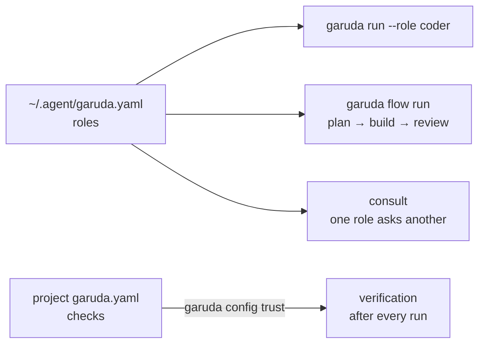
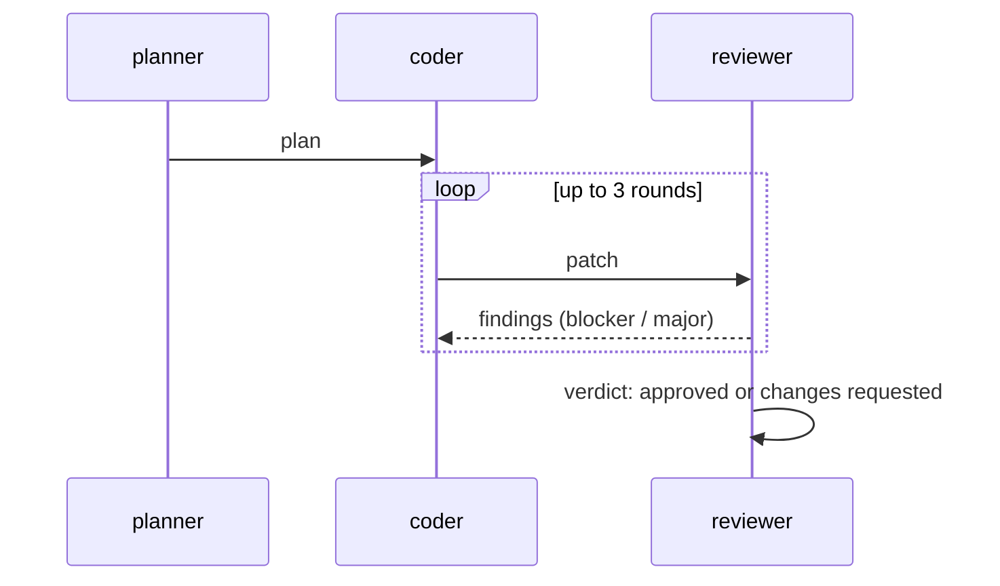

# Level 5 · Build a team of roles

<span class="gd-level">Level 5</span> Name **roles** (scout, planner, coder,
reviewer) and say which harness and exact model each one uses. Then run
tasks as a role, chain roles into **flows** with an independent review, let
one role ask another for advice, and require checks for every run in a
project.



## Set up your roles

<p class="gd-facts">Writes: <code>~/.agent/garuda.yaml</code>, only after you confirm</p>

**Use it when** you use more than one model or harness and want each job to
go to the right one.

```bash
garuda init
garuda doctor
garuda config show
```

**What happens**

- `garuda init` looks up which harnesses are on your `PATH` (it runs nothing)
  and proposes `scout`, `planner`, `coder` and `reviewer` roles on them. It
  shows the file and writes it only after you say yes. Pass
  `--model HARNESS=ID` to fill in exact model IDs.
- `garuda doctor` checks the configuration and, for each harness your roles
  use, that it is installed and logged in. Every problem comes with a fix. It
  exits `1` on an error, so you can use it in scripts.
- `garuda config show` prints the effective configuration and where each value
  came from.

A `garuda.yaml` you might end up with:

=== "Claude Code and Codex"

    ```yaml
    # ~/.agent/garuda.yaml
    version: 1
    defaults: {role: coder}
    roles:
      scout:    {harness: claude, model_id: haiku, permissions: readonly, write_policy: no-edits}
      planner:  {harness: claude, model_id: opus, permissions: smart, write_policy: no-edits}
      coder:    {harness: codex, model_id: MODEL_ID, effort: high,
                 fallback: [{harness: claude, model_id: sonnet}]}
      reviewer: {harness: claude, model_id: sonnet, permissions: smart, write_policy: no-edits}
    ```

    Replace `MODEL_ID` with an exact model ID your Codex account offers. Both
    harnesses need their ACP adapters; `garuda doctor` prints the install
    steps.

=== "Native only (API keys)"

    ```yaml
    # ~/.agent/garuda.yaml
    version: 1
    roles:
      scout:    {harness: native, model_id: openrouter/deepseek/deepseek-v4-flash-0731, permissions: readonly, write_policy: no-edits}
      planner:  {harness: native, model_id: openrouter/deepseek/deepseek-v4-flash-0731, permissions: smart, write_policy: no-edits}
      coder:    {harness: native, model_id: openrouter/deepseek/deepseek-v4-flash-0731, consult: [planner]}
      reviewer: {harness: native, model_id: openrouter/qwen/qwen3-coder-next, permissions: smart, write_policy: no-edits}
    ```

    ```text
    · config.ok: garuda.yaml read; roles: coder, planner, reviewer, scout
        fix: Nothing to do.
    ```

- `harness` is a runtime ID from `garuda runtime list` (`native`, `claude`,
  `codex`, `cursor`, `opencode`, `pi`, `goose`).
- `model_id` is used exactly as written, never matched loosely. For an
  external harness, Garuda selects that model in the harness before the first
  prompt, and refuses if the harness doesn't offer it.
- `write_policy: no-edits` makes a role [check that it changed
  nothing](explore.md#make-sure-a-run-changes-nothing).
- The file is strict: an unknown key or a bad value is refused with its full
  path before anything starts. Every key is in
  [Configuration → roles and flows](../guides/configuration.md#roles-and-flows-garudayaml).

## Run a task as a role

<p class="gd-facts">Uses: the role's harness, exact model, effort and permissions</p>

```bash
garuda run --role coder -t "Add input validation to the signup form"
```

```text
[garuda] role coder: native (openrouter/deepseek/deepseek-v4-flash-0731)
```

**What happens**

- The role sets the runtime, model, reasoning effort and permission ceiling,
  as the matching flags would. A `--permission-mode` you pass combines with the
  role's ceiling, and the stricter one wins.
- With `defaults: {role: coder}`, every `garuda run` uses that role unless you
  pass `--runtime` or `--model`.
- `roles.<name>.agent: careful-coder` runs the role under one of
  [your agents](customize.md#create-your-own-agent). On an external harness
  only the agent's effort, permission mode and added instructions apply; any
  other setting is refused by name.

**If a harness isn't available**, a role's `fallback` list is tried once,
before anything is sent: Garuda moves on only when the harness's CLI is
missing, you're logged out, or a proven limit reading says its quota is used
up until a reset that hasn't passed. It never falls back after a prompt was
sent. The session records which harness was planned, which one ran, and why.

## Run a plan → build → review flow

<p class="gd-facts">Runs: one session per step · Holds: the workspace for the whole flow</p>

**Use it when** you want a plan, an implementation and an independent review
of it, in one command.

```bash
garuda flow run plan-only -t "Plan how to add a median(values) function to src/calc"
garuda flow show FLOW_ID
```

```text
[garuda] scout: done
[garuda] plan: done
{"flow_session": "1bf42dd5-db56-4259-86cd-407166a70cd7", "state": "completed"}

flow plan-only: completed
  scout (attempt 1): done; outputs: notes
  plan (attempt 1): done; outputs: plan
```

Three flows ship with Garuda:

| Flow | Steps | Changes the workspace? |
|---|---|---|
| `plan-only` | scout → planner | No |
| `pair` | coder, reviewed by reviewer (up to three rounds) | Yes (the coder) |
| `plan-build-review` | planner → coder, reviewed by reviewer | Yes (the coder) |



**What happens**

- Each step runs as its own session under its role. Steps pass typed
  **artifacts** (`plan`, `patch`, `review`, `findings`, `notes`, `summary`) and
  nothing else. A step's output becomes an artifact only inside a
  `<garuda-artifact type="plan">…</garuda-artifact>` block at the end of its
  answer.
- Read-only steps (`write_policy: no-edits`) are checked afterwards; if one
  changed the workspace, the flow stops and its output is withheld.
- A reviewer that finds a `blocker` or `major` problem sends the coder back,
  with the findings, for up to `max_rounds` more rounds. The flow ends
  `review_approved` or `review_changes_requested`. A review is not
  verification.
- The reviewer must be **independent**: it may not run as the same harness and
  model as the coder, one of the coder's fallbacks, or a role the coder may
  consult. Otherwise the flow stops with `flow.review_not_independent`.
- If Garuda is killed mid-step, that step is quarantined, never replayed.
  `garuda flow resume FLOW_ID` continues after the last finished step.

!!! warning "Native roles in flows: two current limitations"
    - A native step's output is the summary it passes to `task_complete`, so
      its `<garuda-artifact>` block must be in that summary. If it isn't, the
      flow stops with `flow.output_missing`.
    - A read-only native step can still be held back by the completion
      checker, which asks for evidence that a read-only step can't produce.

    Until these are fixed, give native roles an agent that says so, and turn
    the checker off for read-only steps (allowed in your own agents only):

    ```yaml
    # ~/.agent/agents/flow-plan.yaml (use garuda/reviewer for a review role)
    version: 1
    extends: garuda/plan
    instructions:
      text: |
        When you finish, put every <garuda-artifact> block you were asked for
        inside the summary you pass to task_complete.
    completion:
      verifier: false
    ```

    Then set `agent: flow-plan` on the scout and planner roles.

## Write your own flow

<p class="gd-facts">Configured in: <code>garuda.yaml</code> (yours or the project's)</p>

Print a packaged flow, copy it into your `garuda.yaml` under `flows:`, and
edit it. A flow with the same name replaces the packaged one.

```bash
garuda config show --flow plan-build-review
```

```yaml
flows:
  plan-build-review:
    description: A plan, an implementation, and an independent review of it.
    steps:
    - id: plan
      role: planner
      write_policy: no-edits
      outputs: [plan]
    - id: build
      role: coder
      inputs: [plan]
      outputs: [patch]
      review: {by: reviewer, max_rounds: 2}
    - id: review
      role: reviewer
      write_policy: no-edits
      inputs: [patch]
      outputs: [review]
```

A flow that needs a role you haven't defined refuses and lists the roles it
needs. More in the [Sessions and flows guide](../guides/sessions-and-flows.md).

## Let one role ask another

<p class="gd-facts">Runs: the other role read-only, on a snapshot · Configured in: your <code>garuda.yaml</code></p>

**Use it when** a coder should be able to ask a planner or a stronger model a
quick question mid-task.

```yaml
roles:
  coder:   {harness: native, model_id: MODEL_A, consult: [planner]}
  planner: {harness: native, model_id: MODEL_B}
```

```bash
garuda run --role coder -t "Use the consult tool to ask the planner which edge cases median(values) must handle, then summarize"
```

```text
[garuda] consults: 1 (1 answered)
```

**What happens**

- The coder gets a `consult` tool that can only target the roles you listed.
- Each question runs the target as its own **read-only** session on a
  separate snapshot of the workspace. It can't edit your files or run
  commands, and the snapshot is checked afterwards.
- The answer comes back as labelled, untrusted advice. It isn't verification.
- Limits in `consults:` cap questions per session, time, and question and
  answer size. A consulted role can't consult in turn.
- `garuda sessions show` lists each consult (who asked whom, the outcome,
  how long it took) but never the question or answer text.
- Native targets work everywhere. An external target runs only inside the
  Docker read-only confinement described [below](#keep-a-role-from-changing-anything).
  An external harness can't *ask* yet; see
  [External harnesses](../guides/external-harnesses.md#consult-transport).

## Require checks for every run in this project

<p class="gd-facts">Configured in: <code>garuda.yaml</code> at the project root · Runs only after: <code>garuda config trust</code></p>

**Use it when** every task in a repository should count as done only when its
tests pass.

```bash
garuda init --project
```

`init --project` proposes checks from the repository's marker files
(`pyproject.toml`, `package.json`, …). Or write the file yourself:

```yaml
# garuda.yaml
version: 1
checks:
  - run: python -m pytest -q
```

Until you trust it, runs ignore the checks and say so:

```text
[garuda] config.project_untrusted: this project's garuda.yaml is not trusted as it is now; ignoring checks[0] (review it with `garuda config trust`)
```

```bash
garuda config trust
```

```text
[garuda] /path/to/project/garuda.yaml (sha256 cff6f5f7e845bb49) would run:
  check: python -m pytest -q
Trust exactly this file? Any later change needs trust again. [y/N] y
```

From then on, every run ends with the check:

```text
[garuda] verification: passed (trusted-project)
```

**What happens**

- Trust covers those exact bytes in that repository. Any edit to the file
  needs trust again, and a symlinked `garuda.yaml` is refused.
- Trusting needs a terminal; a headless run never creates trust.
- A project file can add checks and flows and narrow your roles. It can't add
  harnesses, fallbacks or consult grants, or raise a permission ceiling.

## Keep a role from changing anything

<p class="gd-facts">Native: read-only guardrail · External: read-only Docker container</p>

- `write_policy: no-edits` on a role (or a flow step) refuses edits and
  commands and checks the workspace afterwards, like
  [`--no-edits`](explore.md#make-sure-a-run-changes-nothing).
- A role on an **external** harness with `permissions: readonly` runs only
  inside a Docker container that Garuda first proves is confined: your
  workspace mounted read-only, a small writable scratch directory, a non-root
  user with no capabilities, and no Docker socket, home directory or
  credentials. Install and log in to the harness inside your own image, then
  name it in your `garuda.yaml`:

    ```yaml
    harnesses:
      claude:
        confinement:
          image: my-claude-acp:latest
    ```

    Without an image, Docker, or a passing proof, the role refuses with
    `workspace.readonly_unenforced`; it never falls back to running on the
    host.

## Move runtime limits into garuda.yaml

```bash
garuda config migrate          # preview
garuda config migrate --write  # write it, keeping a backup
```

```text
[garuda] would write ~/.agent/garuda.yaml:
  + harnesses.native.max_parallel: 2
  + harnesses.claude.max_parallel: 1
[garuda] preview only; run with --write to apply (settings.yaml is not changed)
```

This copies the trusted runtimes and `capacity` limits from
`~/.agent/settings.yaml` into your `garuda.yaml`. It never removes anything
from `settings.yaml`, and running it twice changes nothing.

---

**Next:** drive Garuda from scripts, CI and your own programs in
[Level 6 · Automate](automate.md).
